#### [Part 1](http://www.slideshare.net/dgrapov/data-analysis-workflows-part-1-2015)

<iframe src="http://www.slideshare.net/dgrapov/data-analysis-workflows-part-1-2015" frameborder="0" allowfullscreen></iframe>

##### The following is an example of a data analysis strategy for an integrated metabolomic and proteomic data set. This tutorial is meant to give examples of some of the major common steps in an omic integration analysis workflow. You can check out all of the code in `/report/report.Rmd`.


1. exploratory analysis

2. statistical analysis

3. predictive modeling

4. functional analysis


```r
#set working directory
wd<-"C:/Users/Dmitry/Dropbox/Software/TeachingDemos/Demos/Data Analysis Workflow/"
setwd(wd)

#load dependancies
pkg<-c("ggplot2","dplyr","R.utils","fdrtool","caret","randomForest","pROC")
out<-lapply(pkg, function(x) {
  if(!require(x,character.only = TRUE)) install.packages(x,character.only = TRUE)
  }
)


#bioConductor
source("https://bioconductor.org/biocLite.R")
if(!require("pcaMethods")) biocLite("pcaMethods")
if(!require("pathview")) biocLite("pathview")
if(!require("KEGGREST")) biocLite("KEGGREST")

#load devium functions
#sourceDirectory( "R",recursive=TRUE)
source("http://pastebin.com/raw.php?i=UyDBTA57")
```


```r
#load data
setwd(wd)
load(file="data/data cube") # data.obj
```

##### This data set contains 200 measurements for 54 samples. The samples are comprised of sick and healthy patients measured across two analytical batches.


```r
table(data.obj$raw$sample.meta$group)
```

```
## 
## healthy    sick 
##      27      27
```

```r
table(data.obj$raw$sample.meta$batch)
```

```
## 
## batch_1 batch_2 
##      28      26
```

****

### Exploratory Analysis

****

##### A critical aspect of any data analysis should be to carry out an exploratory data analysis to see if there are any strange trends. Below is an example of a Principal Components Analysis (PCA). Lets start by looking at the raw data and caclculate PCA with out anys scaling. 

##### PCA has three main components we can use to evaluate our data. 
##### 1. Variance explained by each component

```r
data.cube<-data.obj$raw
args<-list(  pca.data 		= data.cube$data,
			pca.algorithm 	= "svd",
			pca.components 	= 8,
			pca.center 		= FALSE,
			pca.scaling 	= "none",
			pca.cv 			= "q2"
			)
			
#calculate and view scree plot			
res<-devium.pca.calculate(args,return="list",plot=TRUE)
```

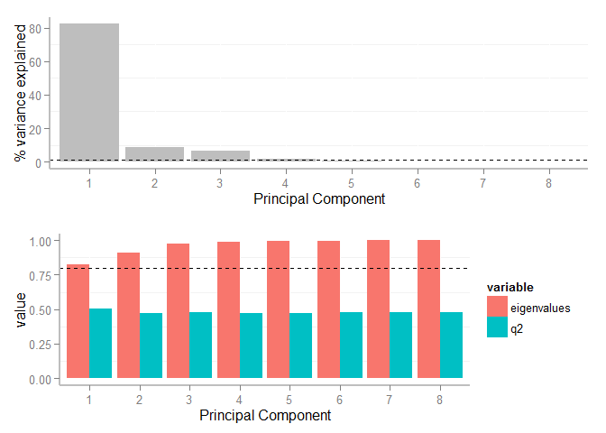 

##### The scree plot above shows the total variance in the data explained (top) and the cumulative varince explained (bottom) by each principal component (PC). The green bars in the bottom plot show the cross-validated variance explained which can be used to give us an idea bout the stability of calculated components. How many PCs to keep can be determined based on a few criteria 1) each PC should explain some minnimum variance and 2)  calculate enough PCS to explain some target variance. The hashed line in the top plot shows PCs which explain less than 1% variance and the hashed line in the bottom plot shows how many PCs arerequired to explain 80% of the varince in the data. Based on an evaluation of the scree plot we may select 2 or 3 PCs. The cross-validated varince explained (green bars) also suggest that the variance explained does not increase after the first 2 PCs.

##### 2. The sample scores can be used to visualize multivariete similarities in samples given all the varibles for each PC. Lets plot the scores and highlight the sick and healthy groups.

```r
#plot results
#scores highlighting healthy and sick
p.args<-list( 
  		pca = res,
			results = "scores",
			color = data.cube$sample.meta[,"group",drop=FALSE],
			font.size = 3
			)

do.call("plot.PCA",p.args)
```

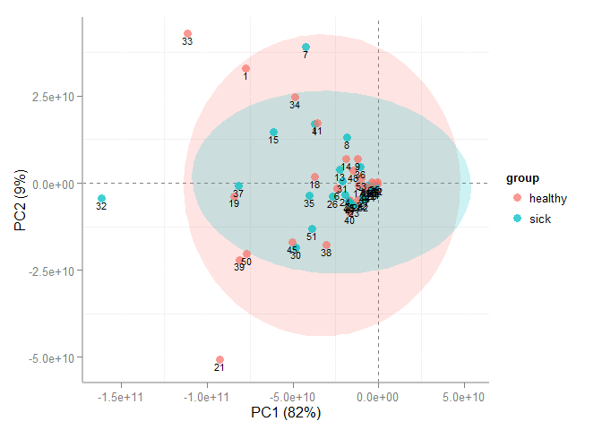 

#### Based on the scores above the sick and healthy samples look fairly similiar. Lets next look at the variable loadings.
#### 3. Variable loadings show the contribution of each varible to the calculated scores.


```r
#loadings
p.args<-list( 
  		pca = res,
			results = "loadings",
			color = data.cube$variable.meta[,"type",drop=FALSE],
			font.size = 3
			)

do.call("plot.PCA",p.args)
```

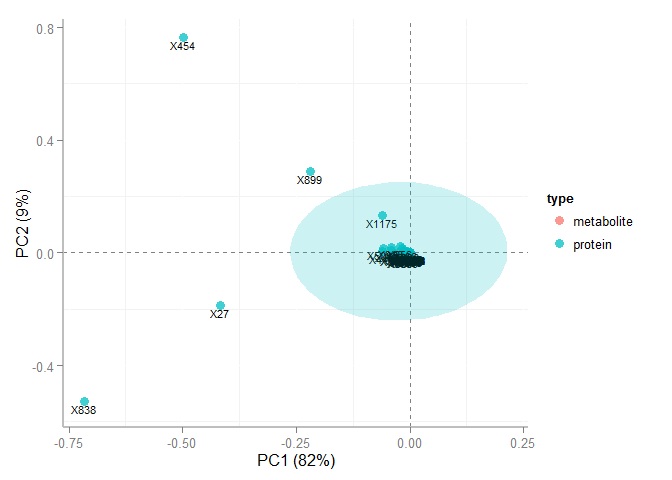 

#### Evaluation of the loadings suggest that variance variables X838 abd X454 explain  ~90% of the varince in the data. Because we did not scale the data before conducting PCA, variables with the largest magnitude will contribute most to varince explained. 

#### Next lets recalculate the PCA and mean center and scale all the variables by their standard deviation (autoscale).
#### Variance explained

```r
args<-list(  pca.data 		= data.cube$data,
			pca.algorithm 	= "svd",
			pca.components 	= 8,
			pca.center 		= TRUE,
			pca.scaling 	= "uv",
			pca.cv 			= "q2"
			)
			
#calculate and view scree plot			
res2<-devium.pca.calculate(args,return="list",plot=TRUE)
```

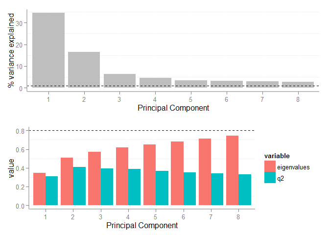 

#### Variable loadings

```r
#loadings
p.args<-list( 
			pca = res2,
			results = "loadings",
			color = data.cube$variable.meta[,"type",drop=FALSE],
			font.size = 3
			)

do.call("plot.PCA",p.args)
```

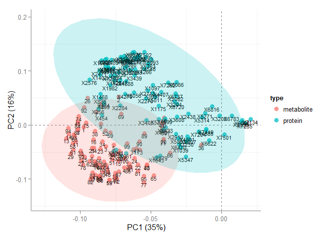 

#### Sample scores

```r
#plot results
#scores highlighting healthy and sick
p.args<-list( 
			pca = res2,
			results = "scores",
			color = data.cube$sample.meta[,"group",drop=FALSE],
			font.size = 3
			)

do.call("plot.PCA",p.args)
```

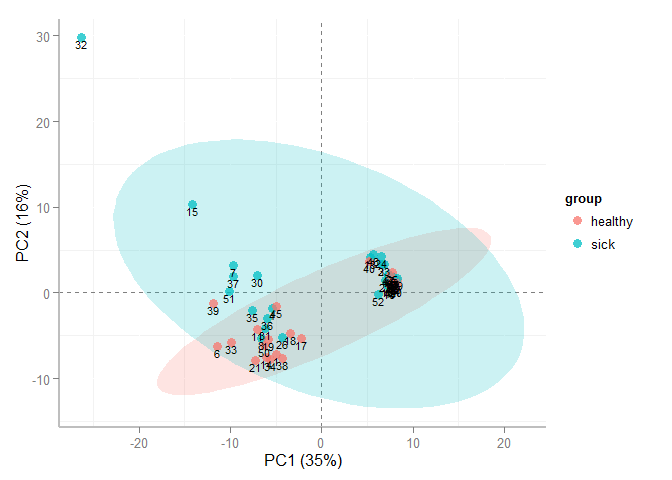 

#### There are some noticible differences in PCA after we scaled our data.
1. Variable magnitude no longer drives the majority of the variance.
2. We can see more resolution in variable loadings for the first 2 PCs.
3. There is an unexplained group structure in the score.

#### Next we can try mapping other meta data to score to see if we can explain the cluster pattern. Lets show the analytical batches in the samples scores.

```r
p.args<-list( 
  		pca = res2,
			results = "scores",
			color = data.cube$sample.meta[,"batch",drop=FALSE],
			font.size =3
			)

do.call("plot.PCA",p.args)
```

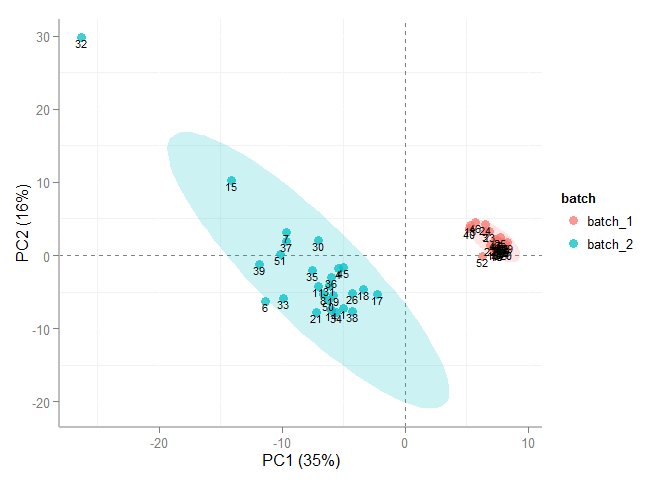 

#### We can see in the scores above that the analytical batch nicely explains 35% of the varince in the data. This is a common problem in large data sets which is best handled using various data normalization methods. Here is some more information about implementing data normalizations.

###### [Metabolomics and Beyond: Challenges and Strategies for Next-generation Omic Analyses](https://imdevsoftware.files.wordpress.com/2015/09/clipboard01.png?w=300&h=225)

[](https://www.youtube.com/watch?v=4AhBN5Q1oMs)

##### [Evaluation of data normalization methods](http://www.slideshare.net/dgrapov/case-study-metabolomic-data-normalization-example)

****

#### [Part 3](hhttp://www.slideshare.net/dgrapov/data-analysis-workflows-part-2-2015?related=1)

<iframe width="420" height="315" src="http://www.slideshare.net/dgrapov/data-analysis-workflows-part-2-2015?related=1" frameborder="0" allowfullscreen></iframe>

### Statistical Analysis

****

##### Next lets carry out a statistical analysis and summarise the changes between the sick and ghealthy groups. Below we identify significantly altered analytes using a basic t-test with adjustment for multiple hypotheses tested. We probably want to use more sophisticated and non-parametric tests for real applications.


```r
#get summaries and t-test stats
data.cube<-data.obj$normalized
data<-data.cube$data
meta<-data.cube$sample.meta[,"group",drop=FALSE] 

#get summary
.summary<-stats.summary(data,comp.obj=meta,formula=colnames(meta),sigfigs=3,log=FALSE,rel=1,do.stats=TRUE)
```

```
## Generating data summary... 
## Conducting tests... 
## Conducting FDR corrections...
```

```r
stats.obj<-cbind(data.cube$variable.meta,.summary)
stats.obj %>% arrange(group_p.values) %>% head(.)
```

```
##       ID                     description       type
## 1 C00077                       ornithine metabolite
## 2 C02477                tocopherol alpha metabolite
## 3 C00097                        cysteine metabolite
## 4 C00031                         glucose metabolite
## 5 C00170 5'-deoxy-5'-methylthioadenosine metabolite
## 6 C00385                        xanthine metabolite
##   healthy.mean.....std.dev sick.mean.....std.dev mean.sick_mean.healthy
## 1            7300 +/- 2900         3910 +/- 2100                   0.54
## 2            1160 +/- 1400         2600 +/- 1200                   2.24
## 3            5160 +/- 2500         8460 +/- 3400                   1.64
## 4         335000 +/- 2e+05     144000 +/- 140000                   0.43
## 5               216 +/- 83           355 +/- 160                   1.64
## 6              574 +/- 350         1670 +/- 1500                   2.91
##   group_p.values group_adjusted.p.values group_q.values
## 1   9.433317e-06             0.001886663    0.000900412
## 2   1.505034e-04             0.007714558    0.003632462
## 3   1.507843e-04             0.007714558    0.003633836
## 4   1.542912e-04             0.007714558    0.003650646
## 5   2.004055e-04             0.008016221    0.003825749
## 6   3.909048e-04             0.013030159    0.006072846
```

```r
#write.csv(stats.obj,file="results/statistical_results.csv")
```

#### We can visualize the differences in means for the top most altered metabolite and protein as a box plot.

```r
top.met<-stats.obj %>% filter(type =="metabolite") %>% 
  arrange(group_p.values) %>% dplyr::select(ID) %>% 
  dplyr:: slice(.,1) %>% unlist(.) %>% as.character(.)
id<-as.character(stats.obj$ID) %in% top.met
tmp.data<-data.frame(data[,id,drop=FALSE],meta)
#make plot
ggplot(tmp.data,aes_string(x="group",y=colnames(tmp.data)[1],fill="group")) + 
  geom_boxplot() + ggtitle(as.character(stats.obj$description[id])) +ylab("")
```

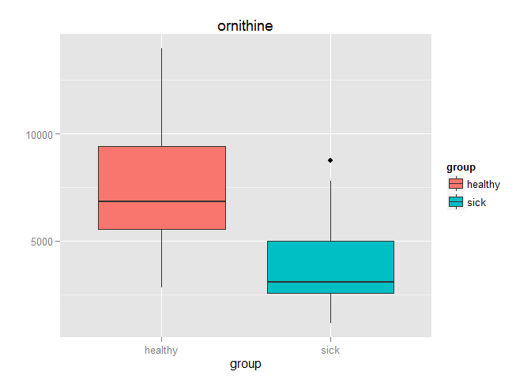 

```r
top.met<-stats.obj %>% filter(type =="protein") %>% 
  arrange(group_p.values) %>% dplyr::select(ID) %>% 
  dplyr:: slice(.,1) %>% unlist(.) %>% as.character(.)
id<-as.character(stats.obj$ID) %in% top.met
tmp.data<-data.frame(data[,id,drop=FALSE],meta)
#make plot
ggplot(tmp.data,aes_string(x="group",y=colnames(tmp.data)[1],fill="group")) + 
  geom_boxplot() + ggtitle(as.character(stats.obj$description[id])) +ylab("")
```

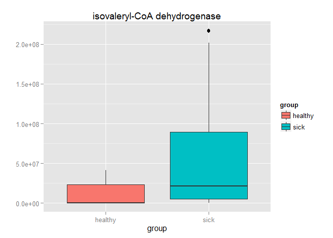 

****

### Predictive Modeling

****

#### Next we can try a generate a non-linear multivarite classification model to identify important variables in our data. Below we will train and validate a random forest classifier. The full data set is split into 2/3 trainning and 1/3 test set while keeping the propotion of sick and healthy samples equivalent. The model is trained using 3-fold cross-validation repeated 3 times and the ```mtry``` parameter is optimized to maximize the are under the reciever operator characteristic curve (AUCROC).


```r
#create a classification model using random forests
#generate training/test set
set.seed(998)
data<-data.cube$data
inTraining <- createDataPartition(data.cube$sample.meta$group, p = 2/3, list = FALSE)
train.data <- data[ inTraining,]
test.data  <- data[-inTraining,]
train.y <- data.cube$sample.meta$group[ inTraining] %>% droplevels()
test.y <- data.cube$sample.meta$group[ -inTraining] %>% droplevels()

#set model parameters
fitControl <- trainControl(## 10-fold CV
                          method = "repeatedcv",
                          number = 3,
                          ## repeated ten times
                          repeats = 3,
                          classProbs = TRUE,
                          summaryFunction = twoClassSummary
				)
						   
						   
#fit model to the training data
set.seed(825)
fit<- train(train.y ~ ., data = train.data,
            method = "rf",
            trControl = fitControl,
            metric = "ROC",
            tuneLength = 3  
         )
```

#### Below the optimal model is chosen while varying the ```mtry``` or the number of variables randomly sampled as candidates at each split. 

```r
fit
```

```
## Random Forest 
## 
##  36 samples
## 199 predictors
##   2 classes: 'healthy', 'sick' 
## 
## No pre-processing
## Resampling: Cross-Validated (3 fold, repeated 3 times) 
## 
## Summary of sample sizes: 24, 24, 24, 24, 24, 24, ... 
## 
## Resampling results across tuning parameters:
## 
##   mtry  ROC        Sens       Spec       ROC SD      Sens SD    Spec SD  
##     2   0.7870370  0.7222222  0.7777778  0.08098544  0.2041241  0.1666667
##   101   0.8549383  0.7777778  0.7592593  0.10090044  0.1443376  0.2060055
##   200   0.8750000  0.8333333  0.7222222  0.09107554  0.1178511  0.2204793
## 
## ROC was used to select the optimal model using  the largest value.
## The final value used for the model was mtry = 200.
```

#### Next we can evaluate the model performance based on predictions for the test set. We can also look at the ROC curve. 

```r
#predict the test set
pred<-predict(fit,newdata=test.data)
prob<-predict(fit,newdata=test.data,type="prob")
obs<-test.y
table(pred,obs)
```

```
##          obs
## pred      healthy sick
##   healthy       7    2
##   sick          2    7
```

```r
#get performance stats
twoClassSummary(data=data.frame(obs,pred,prob),lev=levels(pred))
```

```
##       ROC      Sens      Spec 
## 0.9135802 0.7777778 0.7777778
```

#### We can also look at the ROC curve. 

```r
x<-roc(obs,prob[,levels(pred)[1]],silent = TRUE)
plot(x)
```

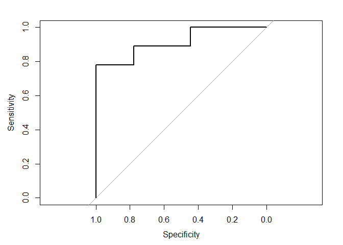 

```
## 
## Call:
## roc.default(response = obs, predictor = prob[, levels(pred)[1]],     silent = TRUE)
## 
## Data: prob[, levels(pred)[1]] in 9 controls (obs healthy) > 9 cases (obs sick).
## Area under the curve: 0.9136
```

#### Having validated our model next we can look at the most important variables driving the classification. We can look at the differences in performance when each variable is randomly permuted or the VIP.

```r
#need to get variable names
vip<-varImp(fit)$importance # need to keep rownames
vip<-vip[order(vip[,1],decreasing=TRUE),,drop=FALSE][1:10,,drop=FALSE]
id<-colnames(train.data) %in% gsub('`','',rownames(vip))
tmp.data<-data.frame(importance=vip[,1],variable=factor(stats.obj$description[id],levels=stats.obj$description[id],ordered=FALSE))

#plot
ggplot(tmp.data, aes(x=variable,y=importance)) + geom_bar(stat="identity") + coord_flip()
```

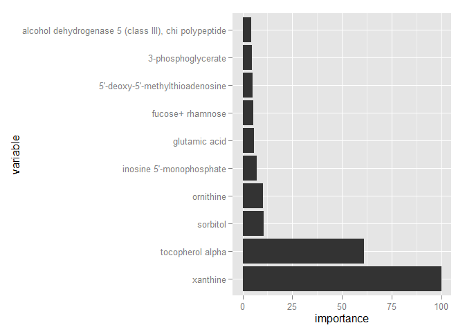 

```r
id<-as.character(stats.obj$description) %in% as.character(tmp.data[1,2])
tmp.data<-data.frame(data[,id,drop=FALSE],meta)
#make plot
ggplot(tmp.data,aes_string(x="group",y=colnames(tmp.data)[1],fill="group")) + 
  geom_boxplot() + ggtitle(as.character(stats.obj$description[id])) +ylab("")
```

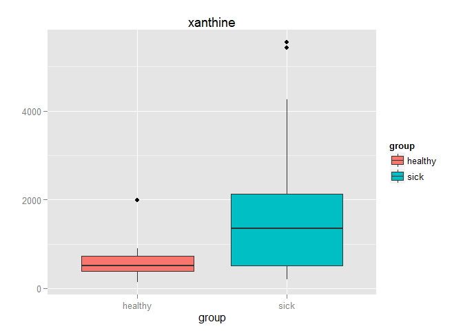 

****

### Functional Analysis

****

#### Finally we can identify enriched biological pathways based on the integrated changes in genes and proteins. [IMPaLA: Integrated Molecular Pathway Level Analysis](http://impala.molgen.mpg.de/) can be used to calculate enriched pathways in genes or proteins and metabolites.To do this we can querry the significantly alterd proteins and metabolites for enriched pathways (see `results/statistical_results_sig.csv`). We can view the full analysis results in `results/IMPaLA_results.csv`. next lets take an enriched pathway and fisualize the fold changes between sick and healthy in the enriched species. 


```r
#format data to show fold changes in pathway
#get formatted data for pathview
library(KEGGREST)
library(pathview)
data<-stats.obj
#metabolite
met<-data %>% dplyr::filter(type =="metabolite") %>%
  dplyr::select(ID,mean.sick_mean.healthy) %>% 
	mutate(FC=log(mean.sick_mean.healthy)) %>% dplyr::select(-mean.sick_mean.healthy)
#protein
prot<-data %>% dplyr::filter(type =="protein") %>%
	dplyr::select(ID,mean.sick_mean.healthy) %>% 
	mutate(FC=log(mean.sick_mean.healthy)) %>% dplyr::select(-mean.sick_mean.healthy)

#set rownames
rownames(met)<-met[,1];met<-met[,-1,drop=FALSE]
rownames(prot)<-prot[,1];prot<-prot[,-1,drop=FALSE]	

#select pathway to view
path<-"Glycolysis / Gluconeogenesis"
```

#### Lets take a looka at the Glycolysis / Gluconeogenesis pathway. Our data needs to be formatted as below. You can also take a look at the following more detailed example of [mapping fold changes to biochemical pathways](https://github.com/dgrapov/TeachingDemos/blob/master/Demos/Pathway%20Analysis/KEGG%20Pathway%20Enrichment.md).

#### Metabolite data showing KEGG ids and log fold change

```r
head(met)
```

```
##                  FC
## C00379   0.41871033
## C00385   1.06815308
## C00105   0.07696104
## C00299  -0.24846136
## C00366   0.33647224
## C00086  -0.05129329
```

#### Protein data showing the Entrez gene name and log fold changes

```r
head(prot)
```

```
##                 FC
## SPTAN1  -0.3424903
## CFH      0.1133287
## VPS13C   0.3148107
## XRCC6    1.0715836
## APOA1   -0.1392621
## SUPT16H  0.7129498
```

#### Next we need to get the pathway code for or pathway of interest.

```r
data(korg)
organism <- "homo sapiens"
matches <- unlist(sapply(1:ncol(korg), function(i) {
    agrep(organism, korg[, i])
}))
(kegg.code <- korg[matches, 1, drop = F])
```

```
##      kegg.code
## [1,] "hsa"
```

#### Now we can visualize the changes between sick and healthy in the Glycolysis / Gluconeogenesis pathway.

```r
setwd(wd)
pathways <- keggList("pathway", kegg.code)
#get code of our pathway of interest
map<-grepl(path,pathways) %>% pathways[.] %>% names(.) %>% gsub("path:","",.)
map
```

```
## [1] "hsa00010"
```

```r
#create image
setwd("report")
pv.out <- pathview(gene.data = prot, cpd.data = met, gene.idtype = "SYMBOL", 
    pathway.id = map, species = kegg.code, out.suffix = map, keys.align = "y", 
    kegg.native = T, match.data = T, key.pos = "topright")
```
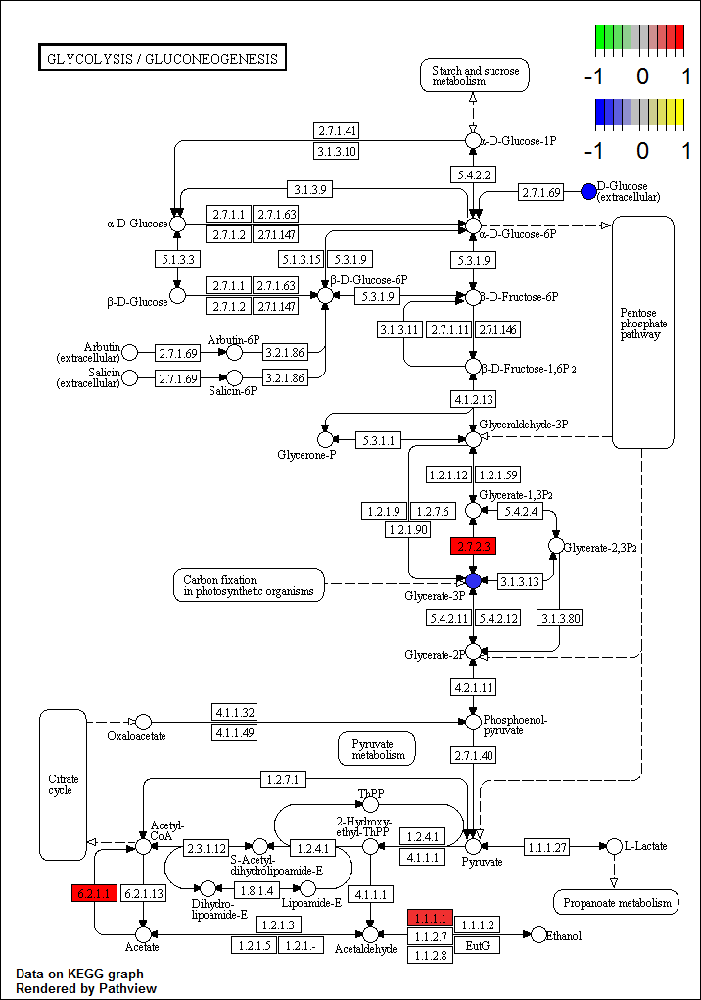

****

#### This concludes this short tutorial. You may also find the following links useful.

* [Software tools](https://github.com/dgrapov)
* [More examples and demos](https://imdevsoftware.wordpress.com/)

&copy; Dmitry Grapov (2015) <a rel="license" href="http://creativecommons.org/licenses/by-nc-sa/4.0/" target="_blank"></a>
