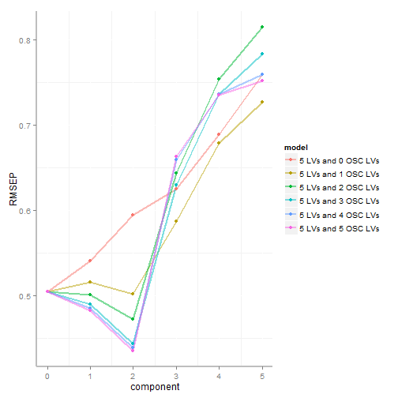
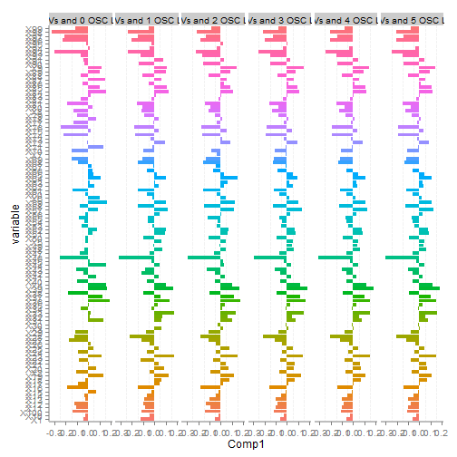
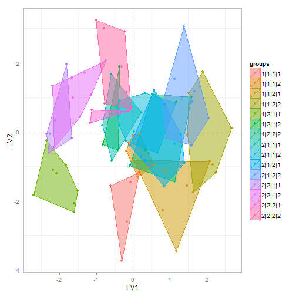
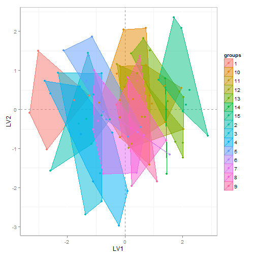

Orthogonal Signal Correction Partial Least Squares (O-PLS) 
========================================================

#### This is an example of O-PLS modeling in R. See here for [more O-PLS options](https://raw.github.com/dgrapov/devium/master/R/Devium%20PLS%20%20and%20OPLS.r) or try [PLS](http://cran.r-project.org/web/packages/pls/index.html).


#### To get things started source the [Devium](https://github.com/dgrapov/devium) repository for O-PLS and accesory functions.
```r 
source("http://pastebin.com/raw.php?i=JVyTrYRD")
``` 


#### Generate some random data and Y's.

```r
set.seed(1234)
data <- matrix(rnorm(10000, 0, 1), nrow = 100, ncol = 100)
simple.y <- matrix(rep(1:2, 50), , 1)
complex.y <- matrix(sample(1:2, 400, replace = T), , 4)
```


#### Make exploratory model. Fit 5 latent variable (LVs) and 5 orthogonal latent variables (OLVs). 

```r
# scale data
scaled.data <- data.frame(scale(data, scale = T, center = T))

comp <- ocomp <- 5  # maximum number of latent variables (LVs)
pls.y <- simple.y

mods1 <- OSC.correction(progress = FALSE, pls.y = pls.y, pls.data = scaled.data, 
    comp = comp, OSC.comp = ocomp, validation = "LOO", method = "oscorespls", 
    cv.scale = T)
```


#### View root mean squared error of prediction for various number of OLV models. Note X-axis reffers to total number of OLVs not LVs, hence the start at 0.

```r
plot.OSC.results(obj = mods1, plot = "RMSEP", groups = group)
```

```
## Warning: package 'ggplot2' was built under R version 2.15.2
```

 


#### View scores for various models.

```r
# create factor to visualize groups
group <- factor(join.columns(pls.y))  #visualize levels of y
plot.OSC.results(obj = mods1, plot = "scores", groups = group)
```

 


#### View variable loadings for various models.

```r
# create factor to visualize groups
plot.OSC.results(obj = mods1, plot = "loadings")
```

```
## Warning: Stacking not well defined when ymin != 0
```

```
## Warning: Stacking not well defined when ymin != 0
```

```
## Warning: Stacking not well defined when ymin != 0
```

```
## Warning: Stacking not well defined when ymin != 0
```

```
## Warning: Stacking not well defined when ymin != 0
```

```
## Warning: Stacking not well defined when ymin != 0
```

 


#### Get optimal LV/OLV suggestions. This becomes very handy with multiple Ys.

```r
#fit 1:limit LV/OLV models to overview optimal LV and OLV
optimal.model<-optimize.OPLS(max.LV=comp, # max LV
  						tolerance =0.01, #tolerance for accepting higher error models but which are simpler
							pls.y=pls.y,pls.data=scaled.data, # y and data
							validation = "LOO",method="oscorespls",cv.scale=F,# see pls for theses options
							progress=FALSE) # see pls for theses options
```


#### View optimization suggestions.

```r
optimal.model
```

```
## $best
##   RMSEP.1 RMSEP.2 LV OLV pls.y delta.tmp.min.
## 9  0.4724  0.4704  2   2     1              0
## 
## $LV
## [1] 2
## 
## $OLV
## [1] 2
```

##### ```tolerance``` is used to accept higher RMSEP but simpler models.

#### Build optimized model based on optimal.model suggestions.

```r
mods1 <- OSC.correction(progress = FALSE, pls.y = pls.y, pls.data = scaled.data, 
    comp = optimal.model$LV, OSC.comp = optimal.model$OLV, validation = "LOO", 
    method = "oscorespls", cv.scale = T)
```


#### Get all model information.

```r
final <- get.OSC.model(obj = mods1, OSC.comp = optimal.model$OLV)
```


#### View model scores.

```r
group <- factor(join.columns(pls.y))  #visualize levels of y
plot.PLS.results(obj = final, plot = "scores", groups = group)
```

 


#### The next step for modeling would be to validate, but I will instead show complex. y modeling.

#### Complex multiple column Y.

```r
# make exploratory model to determine orthogonal LV (OLV) number 
comp<-6 # maximum number of latent variables (LVs)
pls.y<-complex.y
#fit 1:limit LV/OLV models to overview optimal LV and OLV
optimal.model<-optimize.OPLS(max.LV=comp, # max LV
  						tolerance =0.01, #tolerance for accepting higher error models but which are simpler
							pls.y=pls.y,pls.data=scaled.data, # y and data
							validation = "LOO",method="oscorespls",cv.scale=F,# see pls for theses options
							progress=FALSE)  # see pls for theses options
```


#### View suggestions.

```r
optimal.model
```

```
## $best
##     RMSEP.1 RMSEP.2 LV OLV pls.y delta.tmp.min.
## 54   0.4541  0.4528  5   2     1      5.140e-03
## 78   0.4531  0.4521  5   3     1      4.435e-03
## 102  0.4487  0.4476  5   4     1      0.000e+00
## 126  0.4488  0.4478  5   5     1      1.326e-04
## 30   0.4541  0.4528  2   2     2      3.125e-03
## 50   0.4506  0.4497  4   2     2      6.253e-05
## 70   0.4520  0.4511  4   3     2      1.458e-03
## 90   0.4506  0.4496  4   4     2      0.000e+00
## 14   0.4703  0.4693  1   1     3      2.804e-03
## 75   0.4692  0.4676  4   3     3      1.105e-03
## 95   0.4680  0.4665  4   4     3      0.000e+00
## 66   0.4778  0.4763  5   2     3      9.788e-03
## 114  0.4726  0.4711  5   4     3      4.601e-03
## 138  0.4700  0.4686  5   5     3      2.048e-03
## 16   0.4911  0.4910  1   1     4      0.000e+00
## 24   0.4989  0.4981  2   1     4      7.131e-03
## 36   0.4995  0.4987  2   2     4      7.718e-03
## 
## $LV
## [1] 5
## 
## $OLV
## [1] 4
```


#### Build optimized model and plot scores.

```r
mods1 <- OSC.correction(progress = FALSE, pls.y = pls.y, pls.data = scaled.data, 
    comp = optimal.model$LV, OSC.comp = optimal.model$OLV, validation = "LOO", 
    method = "oscorespls", cv.scale = T)
final <- get.OSC.model(obj = mods1, OSC.comp = optimal.model$OLV)  # get all model information

# view model scores
group <- factor(join.columns(pls.y))  #visualize levels of y
plot.PLS.results(obj = final, plot = "scores", groups = group)
```

 


#### An alternative to modeling a multiple Ys is to define a single Y based on the multiple columns. This will try to organize all group scores in one dimension (LV1).

```r
pls.y<-matrix(as.numeric(as.factor(join.columns(complex.y))),,1) # create numeric representation
#fit 1:limit LV/OLV models to overview optimal LV and OLV
optimal.model<-optimize.OPLS(max.LV=comp, # max LV
  						tolerance =0.01, #tolerance for accepting higher error models but which are simpler
							pls.y=pls.y,pls.data=scaled.data, # y and data
							validation = "LOO",method="oscorespls",cv.scale=F,# see pls for theses options
							progress=FALSE) 
```


#### View suggestions.

```r
optimal.model
```

```
## $best
##   RMSEP.1 RMSEP.2 LV OLV pls.y delta.tmp.min.
## 4   4.103    4.09  1   1     1              0
## 
## $LV
## [1] 1
## 
## $OLV
## [1] 1
```

```r
# currently single LV models will cause an error so limit LV minimium to 2
if (optimal.model$LV == 1) {
    optimal.model$LV <- 2
}
```

#### Build optimized model based on optimal.model suggestions.

```r
mods1 <- OSC.correction(progress = FALSE, pls.y = pls.y, pls.data = scaled.data, 
    comp = optimal.model$LV, OSC.comp = optimal.model$OLV, validation = "LOO", 
    method = "oscorespls", cv.scale = T)
final <- get.OSC.model(obj = mods1, OSC.comp = optimal.model$OLV)  # get all model information
```


#### View model scores.

```r
group <- factor(join.columns(pls.y))  #visualize levels of y
plot.PLS.results(obj = final, plot = "scores", groups = group)
```

 


