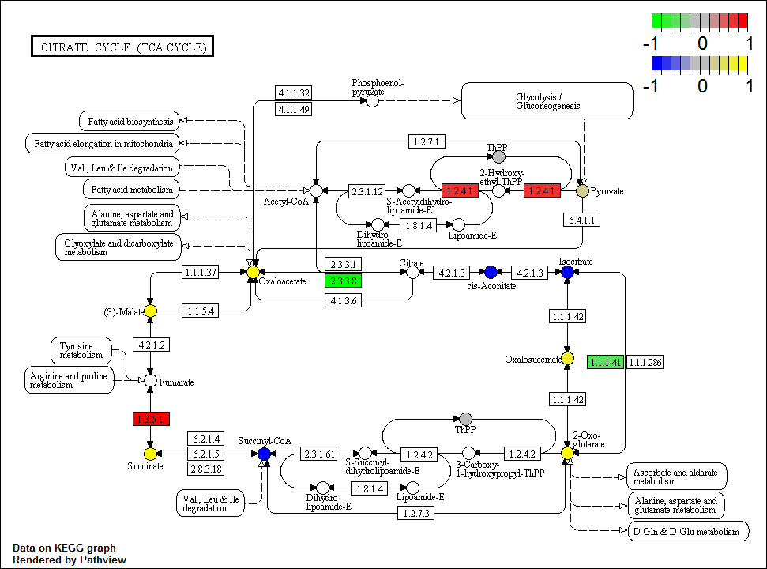
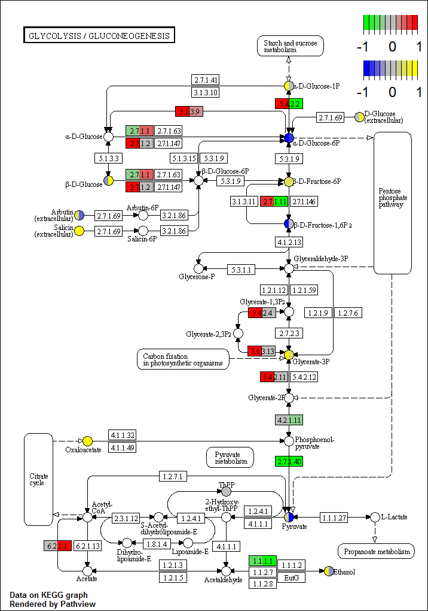

Visualization of KEGG Pathway Enrichment
========================================================
The [KEGG](http://www.genome.jp/kegg/) database is a useful repository of biochemical domain knowledge.
The following is an example of how to map changes in genes, proteins and metabolites on an organism specific basis to KEGG defined [biochemical pathways](http://www.genome.jp/kegg/pathway.html).
For this example we will use the R packages [pathview](http://bioconductor.org/packages/release/bioc/html/pathview.html), [KEGGREST](http://bioconductor.org/packages/2.12/bioc/html/KEGGREST.html) and [KEGGgraph](http://www.bioconductor.org/packages/release/bioc/html/KEGGgraph.html).


To generate a pathway enrichment visualization we minimally need a list of fold changes in biochemical components of interest (e.g. genes, proteins, metabolites). 
We need to supply gene/protein and metabolite/compound fold changes separately as data.frames with rownames specifying database identifiers (see [pathview](http://pathview.r-forge.r-project.org/) for possible options). 
This can be generated based on the output from statistical analysis used to identify any significantly differentially expressed species. 

Lets create gene and metabolite data for a demonstration.

```r
library(pathview)
metabolite.data <- data.frame(FC = sim.mol.data(mol.type = "cpd", nmol = 3000))
```

Lets take a look at the format of the metabolite inputs. 

```r
head(metabolite.data)
```

```
##              FC
## C02787 -1.15260
## C08521  0.46416
## C01043  0.72893
## C11496  0.41062
## C07111 -1.46115
## C00031 -0.01891
```

Notice we have a single column data frame containing log fold changes with KEGG identifiers for the rownames. Next lets load the example gene data. For genes we can specify the organism of interest using the ``species`` argument. We can check for available organisms using the commands below.

```r
data(korg)
head(korg)
```

```
##      kegg.code scientific.name           common.name              
## [1,] "hsa"     "Homo sapiens"            "human"                  
## [2,] "ptr"     "Pan troglodytes"         "chimpanzee"             
## [3,] "pps"     "Pan paniscus"            "bonobo"                 
## [4,] "ggo"     "Gorilla gorilla gorilla" "western lowland gorilla"
## [5,] "pon"     "Pongo abelii"            "Sumatran orangutan"     
## [6,] "mcc"     "Macaca mulatta"          "rhesus monkey"          
##      entrez.gnodes kegg.geneid ncbi.geneid
## [1,] "1"           "100"       "100"      
## [2,] "1"           "100533953" "100533953"
## [3,] "1"           "100967419" "100967419"
## [4,] "1"           "101123859" "101123859"
## [5,] "1"           "100169736" "100169736"
## [6,] "1"           "100301991" "100301991"
```

We can use the columns ``scientific.name`` or ``common.name`` to search for the ``kegg.code`` for our organism of interest. Here is an example of how we can do this for *arabidopsis thaliana*.

```r
organism <- "arabidopsis thaliana"
matches <- unlist(sapply(1:ncol(korg), function(i) {
    agrep(organism, korg[, i])
}))
(kegg.code <- korg[matches, 1, drop = F])
```

```
##      kegg.code
## [1,] "ath"
```


```r
# load gene data
gene.data <- data.frame(FC = sim.mol.data(mol.type = "gene", nmol = 3000, species = kegg.code))
```

Lets take a look at the gene data.

```r
head(gene.data)
```

```
##                 FC
## AT2G21190 -1.15260
## AT1G80990  0.46416
## AT3G48550  0.72893
## AT1G15410  0.41062
## AT3G15220 -1.46115
## AT3G18980 -0.01891
```

Looking at the rownames we can see that the identifiers are specific for arabidopsis thaliana. Using real data it is possible that we will need to translate identifiers to match the type used in pathview. Here are the different identifiers which can be supplied for metabolites.

```r
data(cpd.simtypes)
cpd.simtypes
```

```
## [1] "Beilstein Registry Number" "CAS Registry Number"      
## [3] "ChEMBL COMPOUND"           "KEGG COMPOUND accession"  
## [5] "KEGG DRUG accession"       "Patent accession"         
## [7] "PubMed citation"
```

Here are some possible options for gene identifiers.

```r
data(gene.idtype.list)
gene.idtype.list
```

```
##  [1] "SYMBOL"       "GENENAME"     "ENSEMBL"      "ENSEMBLPROT" 
##  [5] "PROSITE"      "UNIGENE"      "UNIPROT"      "ACCNUM"      
##  [9] "ENSEMBLTRANS" "REFSEQ"
```

We can optionally simulate data with with other identifiers by selecting the appropriate identifier type for the argument `id.type` in the function ``sim.mol.data`` .
 
In the example data above we have the the logarithm of fold changes for 3000 metabolites and 3000 genes. Now that we have the data we can select some pathway of interest to map the fold changes to. 
We could get this information from a pathway enrichment analysis. We would do this by testing if the significantly differential expressed metabolites or genes are enriched for some specific KEGG pathways of interest. Here are some tools to conduct enrichment analysis for genes and metabolites.

* [MBrole](http://csbg.cnb.csic.es/mbrole/) (metabolites)
* [MetaboAnalyst](http://www.metaboanalyst.ca/MetaboAnalyst/faces/Home.jsp) (metabolites)
* [David](http://david.abcc.ncifcrf.gov/) (genes)
* [IMPaLA](http://impala.molgen.mpg.de/) (genes and metabolites) 

For the example below we will randomly select some KEGG pathways. 
We can use the R package [KEGGREST](http://bioconductor.org/packages/2.12/bioc/html/KEGGREST.html) to get all KEGG pathway identifiers for ``arabidopsis thaliana``.


```r
# get names of pathways to visualize
library(KEGGREST)
```

```
## Warning: package 'KEGGREST' was built under R version 3.0.3
```

```r
pathways <- keggList("pathway", kegg.code)
head(pathways)
```

```
##                                                                   path:ath00010 
##             "Glycolysis / Gluconeogenesis - Arabidopsis thaliana (thale cress)" 
##                                                                   path:ath00020 
##                "Citrate cycle (TCA cycle) - Arabidopsis thaliana (thale cress)" 
##                                                                   path:ath00030 
##                "Pentose phosphate pathway - Arabidopsis thaliana (thale cress)" 
##                                                                   path:ath00040 
## "Pentose and glucuronate interconversions - Arabidopsis thaliana (thale cress)" 
##                                                                   path:ath00051 
##          "Fructose and mannose metabolism - Arabidopsis thaliana (thale cress)" 
##                                                                   path:ath00052 
##                     "Galactose metabolism - Arabidopsis thaliana (thale cress)"
```

Lets visualize changes in our genes and metabolites for ``Citrate cycle (TCA cycle) - Arabidopsis thaliana (thale cress)`` which has the KEGG id ``path:ath00020`` .

```r
library(pathview)
map <- gsub("path:", "", names(pathways)[2])  # remove 'path:'
pv.out <- pathview(gene.data = gene.data, cpd.data = metabolite.data, gene.idtype = "KEGG", 
    pathway.id = map, species = kegg.code, out.suffix = map, keys.align = "y", 
    kegg.native = T, match.data = T, key.pos = "topright")
plot.name <- paste(map, map, "png", sep = ".")
```

If everything went as planned this generated a file named ``ath00020.ath00020.png`` mapped KEGG pathway.

We can take a look at the mappings made to this pathway.

```r
head(pv.out)
```

```
## $plot.data.gene
##    kegg.names       labels type   x   y width height      FC mol.col
## 29  AT1G48030       mtLPD1 gene 467 618    46     17      NA #FFFFFF
## 30  AT3G55410    AT3G55410 gene 661 574    46     17      NA #FFFFFF
## 31  AT3G55410    AT3G55410 gene 530 575    46     17      NA #FFFFFF
## 32  AT4G26910    AT4G26910 gene 403 574    46     17      NA #FFFFFF
## 33  AT2G20420    AT2G20420 gene 260 574    46     17      NA #FFFFFF
## 34  AT2G20420    AT2G20420 gene 260 555    46     17      NA #FFFFFF
## 35  AT1G54340         ICDH gene 718 505    46     17      NA #FFFFFF
## 36  AT5G03290       IDH-IV gene 766 458    46     17 -0.4385 #5FDF5F
## 37  AT1G54340         ICDH gene 718 400    46     17      NA #FFFFFF
## 38  AT1G10670       ACLA-3 gene 434 355    46     17 -1.1941 #00FF00
## 39  AT2G47510         FUM1 gene 191 436    46     17      NA #FFFFFF
## 40  AT2G05710         ACO3 gene 670 345    46     17      NA #FFFFFF
## 41  AT2G05710         ACO3 gene 571 345    46     17      NA #FFFFFF
## 42  AT2G42790         CSY3 gene 434 334    46     17      NA #FFFFFF
## 43  AT1G04410    AT1G04410 gene 253 344    46     17      NA #FFFFFF
## 77  AT1G30120 PDH-E1_ALPHA gene 686 241    46     17  0.6117 #EF3030
## 79  AT1G30120 PDH-E1_ALPHA gene 582 241    46     17  0.6117 #EF3030
## 82  AT1G48030       mtLPD1 gene 529 285    46     17      NA #FFFFFF
## 84  AT1G34430      EMB3003 gene 464 242    46     17      NA #FFFFFF
## 91  AT4G37870         PCK1 gene 371 138    46     17      NA #FFFFFF
## 97  AT5G66760       SDH1-2 gene 191 530    46     17  1.1329 #FF0000
## 
## $plot.data.cpd
##    kegg.names labels     type   x   y width height       FC mol.col
## 58     C00022 C00022 compound 737 241     8      8  0.21082 #CECE8F
## 59     C00122 C00122 compound 190 481     8      8       NA #FFFFFF
## 60     C00036 C00036 compound 320 344     8      8  1.42760 #FFFF00
## 61     C05379 C05379 compound 718 453     8      8  0.76991 #EFEF30
## 62     C00024 C00024 compound 400 241     8      8       NA #FFFFFF
## 63     C00149 C00149 compound 190 393     8      8  1.93744 #FFFF00
## 64     C00311 C00311 compound 718 344     8      8 -1.33400 #0000FF
## 65     C00417 C00417 compound 621 344     8      8 -0.82811 #0000FF
## 66     C00042 C00042 compound 190 574     8      8  1.28575 #FFFF00
## 67     C00158 C00158 compound 522 344     8      8       NA #FFFFFF
## 68     C15972 C15972 compound 522 617     8      8       NA #FFFFFF
## 69     C00068 C00068 compound 589 530     8      8  0.01167 #BEBEBE
## 70     C16254 C16254 compound 462 573     8      8       NA #FFFFFF
## 71     C15973 C15973 compound 408 617     8      8       NA #FFFFFF
## 72     C00091 C00091 compound 334 574     8      8 -1.97370 #0000FF
## 73     C00026 C00026 compound 718 573     8      8  1.10432 #FFFF00
## 74     C05381 C05381 compound 593 573     8      8       NA #FFFFFF
## 76     C05125 C05125 compound 631 241     8      8       NA #FFFFFF
## 78     C00068 C00068 compound 631 198     8      8  0.01167 #BEBEBE
## 80     C15972 C15972 compound 580 284     8      8       NA #FFFFFF
## 83     C16255 C16255 compound 517 241     8      8       NA #FFFFFF
## 93     C15973 C15973 compound 478 284     8      8       NA #FFFFFF
## 94     C00074 C00074 compound 471 127     8      8       NA #FFFFFF
```

<!--- -->

We can also display changes in genes/proteins and metabolites for multiple comparisons. To do this lets create some more artificial data and this time lets get protein information. 

```r
metabolite.data2 <- sim.mol.data(mol.type = "cpd", nmol = 3000, nexp = 2)
head(metabolite.data2)
```

```
##            exp1    exp2
## C02787 -1.15260  1.2914
## C08521  0.46416  0.6706
## C01043  0.72893 -0.3065
## C11496  0.41062 -2.1996
## C07111 -1.46115 -0.3476
## C00031 -0.01891  0.7219
```

```r
gene.data2 <- sim.mol.data(mol.type = "gene", nmol = 3000, nexp = 2, id.type = "UNIPROT")
head(gene.data2)
```

```
##            exp1    exp2
## E9PDR7 -1.15260  1.2914
## Q9UBV2  0.46416  0.6706
## Q9BQ95  0.72893 -0.3065
## P24310  0.41062 -2.1996
## Q8N5I0 -1.46115 -0.3476
## Q9Y6J0 -0.01891  0.7219
```

Notice UNIPROT IDs do not map to ``arabidopsis thaliana``. We can check the available mappings by looking at the database of identifiers for ``arabidopsis thaliana`` org.At.tair.db. Lets instead map changes to a human pathway or KEGG code "hsa". 
To do this we need to make sure we supply the correct ``species`` and ``gene.idtype`` arguments. Next lets map changes in proteins and metabolites for the two comparisons to the pathway .
org.At.tairUNIPROT

```r
map <- gsub("path:ath", "", names(pathways)[1])  # remove 'path:ath'
pv.out <- pathview(gene.data = gene.data2, cpd.data = metabolite.data2, gene.idtype = "UNIPROT", 
    pathway.id = map, species = "hsa", out.suffix = map, keys.align = "y", kegg.native = T, 
    match.data = T, key.pos = "topright")
plot.name <- paste(map, map, "multi", "png", sep = ".")
```

This should have generated an image file named ``00010.00010.multi.png``.


We could also map metabolites on a large scale, use the `pathway.id= 01100`.


```r
sessionInfo()
```

```
## R version 3.0.1 (2013-05-16)
## Platform: i386-w64-mingw32/i386 (32-bit)
## 
## locale:
## [1] LC_COLLATE=English_United States.1252 
## [2] LC_CTYPE=English_United States.1252   
## [3] LC_MONETARY=English_United States.1252
## [4] LC_NUMERIC=C                          
## [5] LC_TIME=English_United States.1252    
## 
## attached base packages:
## [1] parallel  stats     graphics  grDevices utils     datasets  methods  
## [8] base     
## 
## other attached packages:
##  [1] KEGGREST_1.2.2       pathview_1.2.4       org.Hs.eg.db_2.9.0  
##  [4] RSQLite_0.11.3       DBI_0.2-7            AnnotationDbi_1.24.0
##  [7] Biobase_2.22.0       BiocGenerics_0.8.0   KEGGgraph_1.16.0    
## [10] graph_1.40.1         XML_3.96-1.1         knitr_1.5           
## [13] rcom_2.2-5           rscproxy_2.0-5      
## 
## loaded via a namespace (and not attached):
##  [1] Biostrings_2.30.1 evaluate_0.5.3    formatR_0.10     
##  [4] grid_3.0.1        httr_0.3          IRanges_1.20.7   
##  [7] png_0.1-7         RCurl_1.95-4.1    Rgraphviz_2.6.0  
## [10] stats4_3.0.1      stringr_0.6.2     tools_3.0.1      
## [13] XVector_0.2.0
```

&copy; Dmitry Grapov (2014) <a rel="license" href="http://creativecommons.org/licenses/by-nc-sa/4.0/" target="_blank"></a>
