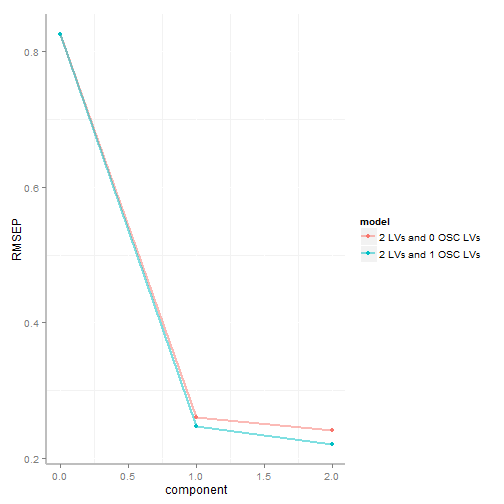
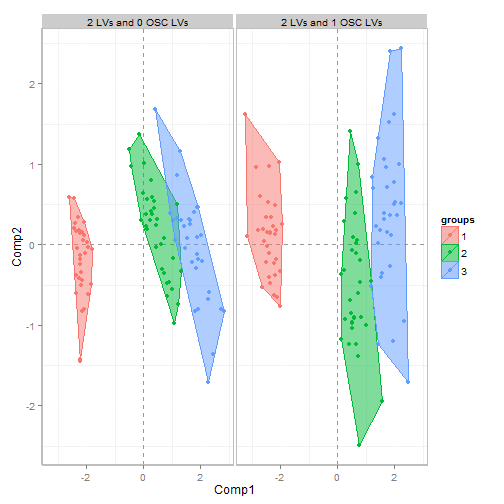
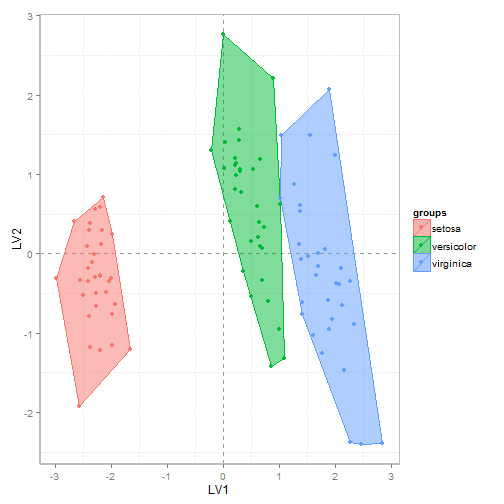
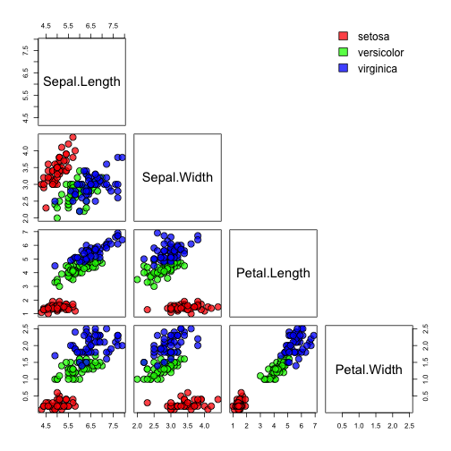

Orthogonal Signal Correction Partial Least Squares (O-PLS) Discriminant Analysis (O-PLS-DA)
========================================================

See here for more [O-PLS](https://raw.github.com/dgrapov/devium/master/R/Devium%20PLS%20%20and%20OPLS.r) methods or try [PLS](http://cran.r-project.org/web/packages/pls/index.html).


```r
source("http://pastebin.com/raw.php?i=UyDBTA57") # source Devium
```

O-PLS-DA demo using Iris data
The goal is to predict the species of the flower based on four physical properties.

This demonstration is focused on O-PLS-DA model: 
- [data pretreatment and preparation](#prep) 
- [model optimization](#oplsda)
- [permutation testing](#perm)
- [internal cross-validation](#intOOB)
- [external cross-validation](#extOOB)


<a name="prep"/>
## Preparation for modeling

```r
data(iris)
tmp.data<-iris[,-5]
tmp.group<-iris[,5] # species
tmp.y<-matrix(as.numeric(tmp.group),ncol=1) # make numeric matrix
```

The data will be split into 1/3 test and 2/3 training sets.
The training data will be used for:

- model optimization
- permutation testing
- internally cross-validated estimate of training and out-of-bag error (OOB)

The hold out set or the test data will be used to estimate the externally validated OOB.

Generate external test set using the duplex or kennard stone method.

```r
train.test.index.main=test.train.split(nrow(tmp.data),n=1,strata=tmp.group,split.type="duplex",data=tmp.data)
train.id<-train.test.index.main=="train"

#partition data to get the trainning set
tmp.data<-tmp.data[train.id,]
tmp.group<-tmp.group[train.id]
tmp.y<-tmp.y[train.id,]

#the variables could be scaled now, or done internally in the model for each CV split (leave-one-out)
#scaled.data<-data.frame(scale(tmp.data,center=TRUE, scale=TRUE)) 
scaled.data<-tmp.data
```

<a name="oplsda"/>
## Train O-PLS-DA model 
Compare a 2 latent variable (LV) PLS-DA and 2 LV with one orthogonal LV (OLV) O-PLS-DA model.

```r
mods<-make.OSC.PLS.model(tmp.y,pls.data=scaled.data,comp=2,OSC.comp=1, validation = "LOO",method="oscorespls", cv.scale=TRUE, progress=FALSE)
#extract model
final<-get.OSC.model(obj=mods,OSC.comp=1)
#view out-of-bag error for cross-validation splits
plot.OSC.results(mods,plot="RMSEP",groups=tmp.group)
```

 

Ideally we want to select the simplest models with lowest root mean squared error of prediction (RMSEP), which in this case is calculated based on leave-one-one cross-validation. 

The 1 LV and 1 orthogonal LV (O-PLS-DA) model has similar error to a simple 2 LV PLS-DA model.

Next we can also compare the change in scores with the addition of the OLV. 

```r
plot.OSC.results(mods,plot="scores",groups=tmp.group)
```

 
Non-overlapping scores for each species could signify a well fit model, but we need to carry out some further validations to be sure.

```r
plot.PLS.results(obj=final,plot="scores",groups=tmp.group)
```

 
Ideally the within species variance should be maximally orthogonal to the between species variance (our goal to maximize)in this case we see this represented by the vertical spread of the three species scores.

<a name="perm"/>
# Permutation Testing
Next we can compare our model fit to random chance. We can do this using permutation testing by generating models for a randomly permuted species label (Y). We will generate 50 permuted models and compare their performance statics to our model. We also first want to generate a pseudo-training/test split for our training data in order to correctly simulate the RMSEP. The permuted models will be fit using the pseudo-training data and then used to predict the species label for the pseudo-test set.

```r
train.test.index=test.train.split(nrow(scaled.data),n=100,strata=as.factor(tmp.y)) # strata controls if the species are sampled from equally
permuted.stats<-permute.OSC.PLS(data=scaled.data,y=as.matrix(tmp.y),n=50,ncomp=2,osc.comp=1, progress=FALSE,train.test.index=train.test.index)
#look how our model compares to random chance
OSC.validate.model(model=mods,perm=permuted.stats)
```

```
## Error: non-numeric argument to binary operator
```

- Q2 represents the in-bag or error for the training data 
- Xvar the variance in the variables (X) explained or captured in the model
- RMSEP is the out-of-bag error (OOB)
- The p-values are from a single-sample t-Test comparing our models 
 performance parameters (single values) to their respective permuted distributions 

<a name="intOOB"/>
# Internal (training set) Cross-validation
Next we can estimate the OOB error within the training set by conducting model training and testing. This is done using the pseudo-training/test split we generated for the model permutations. 


```r
train.stats<-OSC.PLS.train.test(pls.data = scaled.data,pls.y  = tmp.y,train.test.index ,comp=2,OSC.comp=1,cv.scale=TRUE, progress=FALSE)
```

Now we can compare the distributions for our models' performance statistics to their respective permuted distributions.


```r
OSC.validate.model(model=mods,perm=permuted.stats,train=train.stats)
```

```
##                         Xvar                Q2           RMSEP
## model          99.58 ± 0.178   0.8883 ± 0.0537 0.2342 ± 0.0516
## permuted model 99.29 ± 0.457 -0.06332 ± 0.0444 0.8438 ± 0.0566
## p-value            8.437e-05        1.183e-121       3.731e-77
```

This suggests that we have a strong model (far better than random chance) which capable of correctly predicting the species of the flower.
<a name="extOOB"/>
# Model testing
Finally we want to estimate the true estimate of the OOB error by predicting the species labels for the test set we excluded from our data before we even started modeling.

The idea is that the test set was never involved in any of our modeling decisions (pretreatment, feature selection, etc) and is the most honest estimate of our models predictive performance.

```r
#reset data
scaled.data<-iris[,-5]
tmp.group<-iris[,5] 
tmp.y<-matrix(as.numeric(tmp.group),ncol=1)  

#make predictions for the test set
mods<-make.OSC.PLS.model(tmp.y,pls.data=scaled.data,comp=2,OSC.comp=1, validation = "LOO",
method="oscorespls", cv.scale=TRUE, progress=FALSE,train.test.index=train.test.index.main)

#get the true (actual) and predicted values
#round them to integers to represent discreet species labels
plot.data=data.frame(predicted = round(mods$predicted.Y[[2]][,1],0),actual= mods$test.y)
#note these are numeric but we would prefer to interpret classification of species a class
plot.data$predicted<-factor(plot.data$predicted,labels=levels(iris[,5]),levels=1:3)
plot.data$actual<-factor(plot.data$actual,labels=levels(iris[,5]),levels=1:3)

table(plot.data)
```

```
##             actual
## predicted    setosa versicolor virginica
##   setosa         17          0         0
##   versicolor      0         16         1
##   virginica       0          1        16
```

Based on the similarity between virginica and versicolor species' physical properties we expect this to be the most difficult classification to get correct.


```r
pairs(iris[,-5],pch=21,bg=rainbow(nlevels(iris[,5]),alpha=.75)[iris[,5]],upper.panel=NULL,cex=2)
par(xpd=TRUE)
legend(.75,1,levels(iris[,5]),fill=rainbow(nlevels(iris[,5]),alpha=.75),bty="n")
```

 

O-PLS-DA becomes very useful when there are many variables. Model loadings on LV 1 (x-axis) can be used to linearly rank variables with respect to explaining differences in samples which are represented by the model scores. This approach is useful for reducing multidimensional comparisons (e.g. multiple class comparisons, genotype/treatment/time point) to single dimensional ranking of each variable representing it's weight for explaining a given hypothesis (Y) and the goodness of the answer depends on the strength of the produced model. 


