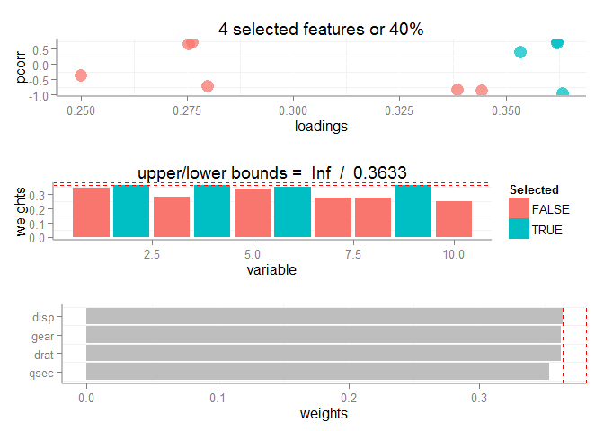
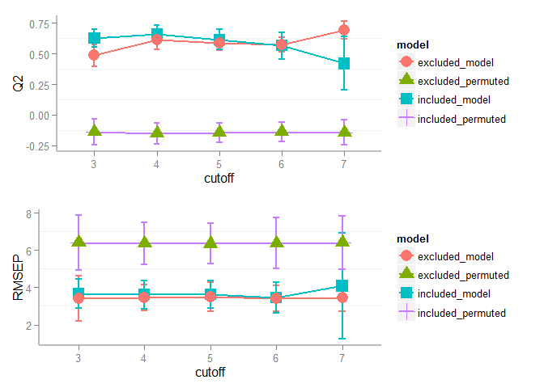

# O-PLS Modeling

Load data set, and set model x and y.

```r
#load library now to prevent loading messages
Sys.setenv(ALLOW_WGCNA_THREADS=1)
suppressPackageStartupMessages(library(WGCNA)) # so annoying
```

```
## ==========================================================================
## *
## *  Package WGCNA 1.41.1 loaded.
## *
## *    Important note: It appears that your system supports multi-threading,
## *    but it is not enabled within WGCNA in R. 
## *    To allow multi-threading within WGCNA with all available cores, use 
## *
## *          allowWGCNAThreads()
## *
## *    within R. Use disableWGCNAThreads() to disable threading if necessary.
## *    Alternatively, set the following environment variable on your system:
## *
## *          ALLOW_WGCNA_THREADS=<number_of_processors>
## *
## *    for example 
## *
## *          ALLOW_WGCNA_THREADS=8
## *
## *    To set the environment variable in linux bash shell, type 
## *
## *           export ALLOW_WGCNA_THREADS=8
## *
## *     before running R. Other operating systems or shells will
## *     have a similar command to achieve the same aim.
## *
## ==========================================================================
```

```r
#data
data(mtcars)

#X
pls.data<-mtcars[,-1]
#y, mpg
pls.y<-mtcars[,1,drop=F]

#make model
opls.results<-make.OSC.PLS.model(pls.y,pls.data,
						comp=2,
						OSC.comp=1, 
						validation = "LOO", 
						cv.scale = TRUE,
						train.test.index=NULL,
						progress=FALSE)				
```

Get 2 latent variables (LVs) and 1 orthogonal LV model stats.

```r
#extra results as some LV and OSC and print model stats
final.opls.results<-get.OSC.model(obj=opls.results,OSC.comp=1)		
(opls.model.text<-data.frame("Xvar"=c(0,round(cumsum(final.opls.results$Xvar)*100,2)),"Q2"=final.opls.results$Q2,"RMSEP"= final.opls.results$RMSEP)	)
```

```
##         Xvar          Q2    RMSEP
##         0.00 -0.06555671 6.123385
## Comp 1 76.67  0.52660903 4.076258
## Comp 2 88.06  0.74269548 3.004066
```

Predict mpg values for held out car data and calculate test error (RMSEP).

```r
#train/test index 2/3 train and 1/3 test
train.test.index <- test.train.split(nrow(pls.data), n = 1) 

#fit model 
mods<-make.OSC.PLS.model(pls.y,pls.data,
						comp=2,
						OSC.comp=1, 
						validation = "LOO", 
						cv.scale = TRUE,
						train.test.index=train.test.index,
						progress=FALSE)	

#view predictions for test data
final.opls.results2<-get.OSC.model(obj=mods,OSC.comp=1)	
fitted<-final.opls.results2$predicted.Y
(RMSEP<-(.MSEP(actual=pls.y[train.test.index=="test",],pred=fitted))^.5)
```

```
## [1] 3.511172
```

Carry out 100 rounds of training and testing cross-validation and get model performance summary.

```r
#train/test index 100 rounds
train.test.index <- test.train.split(nrow(pls.data), n = 100) 
multi.train.test<-OSC.PLS.train.test(pls.data = pls.data, pls.y = pls.y, train.test.index, comp = mods$total.LVs[1], OSC.comp = max(mods$OSC.LVs), cv.scale = mods$model.description$cv.scale, progress = FALSE) # ...
multi.train.test$summary
```

```
##      Xvar             Q2                 RMSEP           
## [1,] "81.01 +/- 8.35" "0.5406 +/- 0.158" "3.641 +/- 2.34"
```

Carry out permutation testing and calculate random chance statistics (null model).

```r
multi.permute<-permute.OSC.PLS.train.test(pls.data = pls.data, pls.y = pls.y, perm.n = 100, comp = mods$total.LVs[1], OSC.comp=max(mods$OSC.LVs), progress = FALSE, train.test.index = train.test.index)
```

Compare model statistical distrubutions to permuted model performance and calculate proportion of times real model was better then permuted model as a p-value.

```r
#compare actual to permuted model performance
(model.validation<-OSC.validate.model(model = mods, perm = multi.permute, train = multi.train.test,test="perm.test"))
```

```
##                           Xvar               Q2          RMSEP
## model           81.01 +/- 8.35 0.5406 +/- 0.158 3.641 +/- 2.34
## permuted model 99.93 +/- 0.316 -0.137 +/- 0.131  6.375 +/- 1.3
## p-value                      1         0.009901        0.05941
```

Carry out a single round of feature selection select top 4 features and plot results.

```r
#feature selection
opts<-PLS.feature.select(pls.data,pls.scores=final.opls.results$scores[,][,1,drop=F],pls.loadings=final.opls.results$loadings[,][,1,drop=F],pls.weight=final.opls.results$loadings[,][,1,drop=F],plot=FALSE,p.value=0.1,FDR=TRUE,cut.type="number",top=4,separate=FALSE)
# make s-plot plus
plot.S.plot(obj=opts,return="all")
```

 

```
## NULL
```

Calculate and compare performance statistics for included and excluded feature models.

```r
optim<-optimize.OPLS.feature.select(model=opls.results,feature.subset=opts$combined.selection,permute=TRUE,train.test.index,progress=FALSE,test="perm.test") 
cbind(model=c(rep(c("model","permuted","p-value"),2),"p.value"),optim$summary)
```

```
##      model      model           Xvar                Q2           RMSEP
## 1    model   selected 98.78 +/- 1.67 0.6627 +/- 0.0698 3.617 +/- 0.764
## 2 permuted   selected      100 +/- 0 -0.1503 +/- 0.075  6.477 +/- 1.07
## 3  p-value   selected              1          0.009901          0.0198
## 4    model   excluded 62.28 +/- 10.7 0.6126 +/- 0.0746  3.453 +/- 0.71
## 5 permuted   excluded 98.42 +/- 4.47 -0.1165 +/- 0.176  6.603 +/- 1.34
## 6  p-value   excluded              1          0.009901          0.0198
## 7  p.value comparison       0.009901            0.2178          0.6931
```

Get model stats for decreasing number of model variables using full model loadings calculated above as a gradient.

```r
#optimize model feature selections 
filter<-seq(3,ncol(pls.data)-3) # number of variables to keep
res<-multi.OPLS.feature.select(model=opls.results,filter=filter,plot=FALSE,OPLSDA=TRUE,train.test.index=train.test.index, test="perm.test", progress=FALSE) # use full model without training split as input
plot.multi.OPLS.feature.select(res,objects=c("RMSEP","Q2")) # view results
```

 

```r
best.OPLS.features(res)[,1:5] # extract best model
```

```
##    type vars    model   Xvar        Q2
## 9 model    7 included 92.582 0.4200007
```


