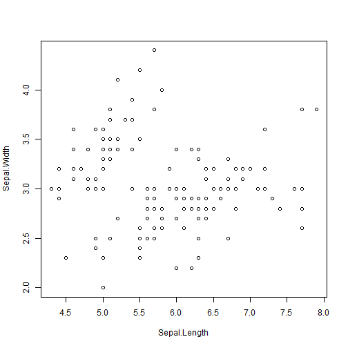
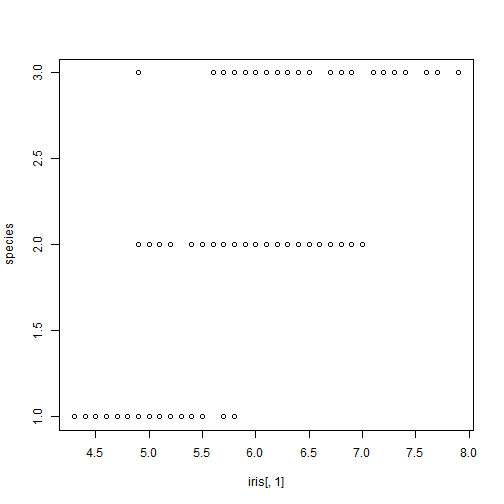
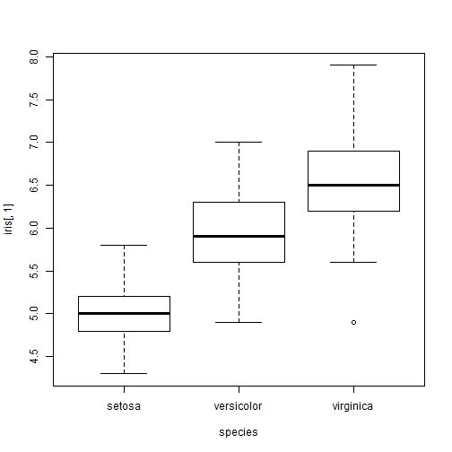
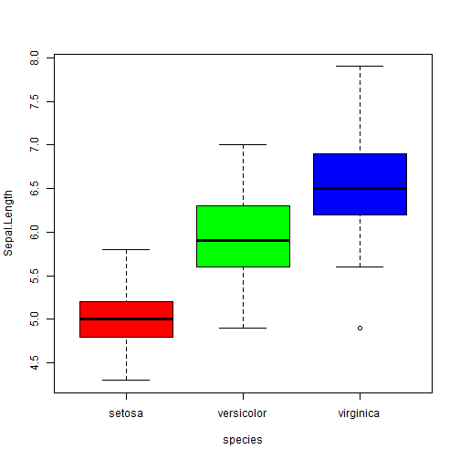
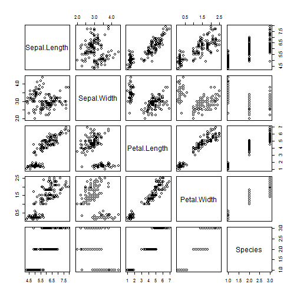
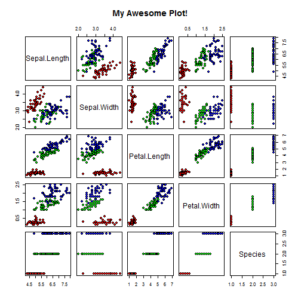

# Getting Started with R Lesson 1
### by Dmitry Grapov


### GOALS:
### * [getting started](#basics) 
### * [basic operators](#operators)
### * [plotting](#plotting)
### * [creating data summaries](#summary)

### For the following examples we will focus on the bare bones to help us learn basic concepts


<a name="basics"/>
### Getting started

```r
# this is a comment R doesn't interpret this
10  # works
```

```
## [1] 10
```

```r
# a # remove comment and try to type a
```


R knows what ``10`` is, it is a number which has been defined in the R environment. However a has not been defined and R throws an error when trying to print it to the console.


```r
"a"  # works
```

```
## [1] "a"
```

```r
a <- 10  # assignment
b <- a + 1  # using a pre assigned variable
```


When we give ``a`` we define that this object is as a character vector "a" which R understands how to print to screen. We can assign ``10`` to something R knows about like for instance ``10``. Having done this we can now use ``10`` as a variable to do whatever we want.

<a name="operators"/>
### Arithmetic operators

```r
a + b  #addition
```

```
## [1] 21
```

```r
a - b  #subtraction
```

```
## [1] -1
```

```r
a * b  #multiplication
```

```
## [1] 110
```

```r
a/b  #division
```

```
## [1] 0.9091
```

```r
a^b  #exponentiation
```

```
## [1] 1e+11
```

```r
a%/%b  #integer division
```

```
## [1] 0
```

```r
a%%b  #modulo (remainder) b%%a makes more sense
```

```
## [1] 10
```


### Relational operators

```r
a == b  #is a equal to b
```

```
## [1] FALSE
```

```r
a > b  # a is greater than b, use < for less than
```

```
## [1] FALSE
```

```r
a >= b  # a is greater than or equal to
```

```
## [1] FALSE
```


### Logical operators

```r
! #not
a!=b # is a equal to be? could also do !a==b    
```

```
## [1] FALSE
```

```r
#& #and
# | #or
# && #sequential and
# || #sequential or
```


### Lets create a new variable to test the logical operators

```r
x <- 1:10  # note ':' creates a sequence
x != a  # notice how the shorter a is recycled
```

```
##  [1]  TRUE  TRUE  TRUE  TRUE  TRUE  TRUE  TRUE  TRUE  TRUE FALSE
```

```r
(id <- !x >= a)  # notice we assigned the results to id and use () to print this
```

```
##  [1]  TRUE  TRUE  TRUE  TRUE  TRUE  TRUE  TRUE  TRUE  TRUE FALSE
```

```r
x > a | x < b  # check if any criteria specified is TRUE
```

```
##  [1] TRUE TRUE TRUE TRUE TRUE TRUE TRUE TRUE TRUE TRUE
```

```r
x > a & x < b  # check if all criteria specified is TRUE
```

```
##  [1] FALSE FALSE FALSE FALSE FALSE FALSE FALSE FALSE FALSE FALSE
```


### Indexing

```r
a[1]  # get the first 'unit' of a
```

```
## [1] 10
```

```r
a[2]  #  trying to reference something which doesn't exist, NA stands for missing value
```

```
## [1] NA
```

```r
x[2]  # this works because x has length >=2
```

```
## [1] 2
```

```r
x[c(1, 2, 6:8)]  # can use c() to get many specific elements
```

```
## [1] 1 2 6 7 8
```

```r
x[id]  # we can also use a logical to get our object
```

```
## [1] 1 2 3 4 5 6 7 8 9
```


### Object properties

```r
str(x)  #structure, x is an integer vector (one dimension)
```

```
##  int [1:10] 1 2 3 4 5 6 7 8 9 10
```

```r
class(id)  # is logical
```

```
## [1] "logical"
```

```r
length(x)  # length
```

```
## [1] 10
```


### Next lets load some real data to experiment with

```r
data(iris)  # we use a function named data to load the iris data
str(iris)  # structure
```

```
## 'data.frame':	150 obs. of  5 variables:
##  $ Sepal.Length: num  5.1 4.9 4.7 4.6 5 5.4 4.6 5 4.4 4.9 ...
##  $ Sepal.Width : num  3.5 3 3.2 3.1 3.6 3.9 3.4 3.4 2.9 3.1 ...
##  $ Petal.Length: num  1.4 1.4 1.3 1.5 1.4 1.7 1.4 1.5 1.4 1.5 ...
##  $ Petal.Width : num  0.2 0.2 0.2 0.2 0.2 0.4 0.3 0.2 0.2 0.1 ...
##  $ Species     : Factor w/ 3 levels "setosa","versicolor",..: 1 1 1 1 1 1 1 1 1 1 ...
```

```r
# notice we have 2 dimensions now, rows and columns now subset the object as
# object[rows,columns]
iris[1:5, 3:4]
```

```
##   Petal.Length Petal.Width
## 1          1.4         0.2
## 2          1.4         0.2
## 3          1.3         0.2
## 4          1.5         0.2
## 5          1.4         0.2
```

```r
species <- iris$Species  # in data.frames and list we can also reference columns with '$'
species <- iris[, "Species"]  # or by name
```


### Lets make some plots

```r
plot(iris[, 1:2])  # plot the first 2 columns
```

 

```r
help(plot)  #see what other arguments plot could take
plot(iris[, 1], species)
```

 

```r
plot(iris[, 1] ~ species)  # plot is different because species is factor and formula notation '~' is used
```

 

```r
plot(iris[, 1] ~ species, col = c("red", "green", "blue"))  # add a color
```

 

```r
plot(iris[, 1] ~ species, col = c("red", "green", "blue"), ylab = colnames(iris)[1])  # and label, use function colnames() to get column names and take the first columns name
```

 

```r
plot(iris)  # because we gave the whole data frame R calls pairs() and creates a scatterplot matrix
```

 

```r
color <- c("red", "green", "blue")[species]  # we can use the factor to subset our colors to create a color for each point
plot(iris, pch = 21, bg = color, main = "My Awesome Plot!")  # here we give custom point shape 'pch', border 'col' and inner color 'bg' as well as a title 'main'
```

 


### Next lets experiment with getting summary statics

```r
mean(iris)  # we want to get the mean but giving the whole data.frame with the factor does not make sense?
```

```
## [1] NA
```

```r
mean(iris[, 1])  # this works
```

```
## [1] 5.843
```

```r
mean(iris[, "Species"])  # this was the issue, it is not numeric (we could coerce 'as.numeric' but why?)
```

```
## [1] NA
```

```r
mean(iris[iris$Species == "setosa", 1])  # here we subset the rows to only get values for the species setosa and return the mean for column 1 for this group
```

```
## [1] 5.006
```


#### Next lets get all column means for the species setosa

```r
apply(iris[iris$Species == "setosa", 1:4], 2, mean)  #here we use function apply to for each column  use the function mean (see help(apply)) 
```

```
## Sepal.Length  Sepal.Width Petal.Length  Petal.Width 
##        5.006        3.428        1.462        0.246
```

```r
# we also removed species because we know mean wont work on this and also
# causes bad behaviour for other columns
```


#### Now lets get the means for each species

```r
big.l <- split(iris[, 1:4], iris$Species)  # create a list holding a data.frame for each level of the species
(res <- lapply(big.l, apply, 2, mean))  # get means for each species and variable
```

```
## $setosa
## Sepal.Length  Sepal.Width Petal.Length  Petal.Width 
##        5.006        3.428        1.462        0.246 
## 
## $versicolor
## Sepal.Length  Sepal.Width Petal.Length  Petal.Width 
##        5.936        2.770        4.260        1.326 
## 
## $virginica
## Sepal.Length  Sepal.Width Petal.Length  Petal.Width 
##        6.588        2.974        5.552        2.026
```

```r
data.frame(res)  # get results combined
```

```
##              setosa versicolor virginica
## Sepal.Length  5.006      5.936     6.588
## Sepal.Width   3.428      2.770     2.974
## Petal.Length  1.462      4.260     5.552
## Petal.Width   0.246      1.326     2.026
```

```r
t(data.frame(res))  # transpose results 
```

```
##            Sepal.Length Sepal.Width Petal.Length Petal.Width
## setosa            5.006       3.428        1.462       0.246
## versicolor        5.936       2.770        4.260       1.326
## virginica         6.588       2.974        5.552       2.026
```


#### Using this basic syntax we can exucute any custom function that we want (more to come later on R libraries to this this in an elegant and efficient way).
#### Lets define a custom function to return the formatted mean and standard deviation, and then use it in the code above.

```r
mean.sd <- function(x) {
    paste0(round(c(mean(x), sd(x)), 1), collapse = " +/- ")  # our custom function
    
}
t(sapply(big.l, apply, 2, mean.sd))
```

```
##            Sepal.Length  Sepal.Width   Petal.Length  Petal.Width  
## setosa     "5 +/- 0.4"   "3.4 +/- 0.4" "1.5 +/- 0.2" "0.2 +/- 0.1"
## versicolor "5.9 +/- 0.5" "2.8 +/- 0.3" "4.3 +/- 0.5" "1.3 +/- 0.2"
## virginica  "6.6 +/- 0.6" "3 +/- 0.3"   "5.6 +/- 0.6" "2 +/- 0.3"
```


