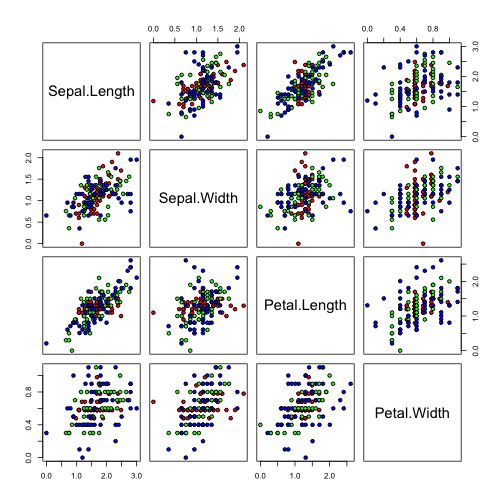
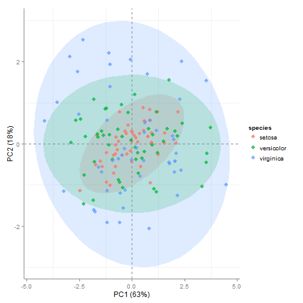
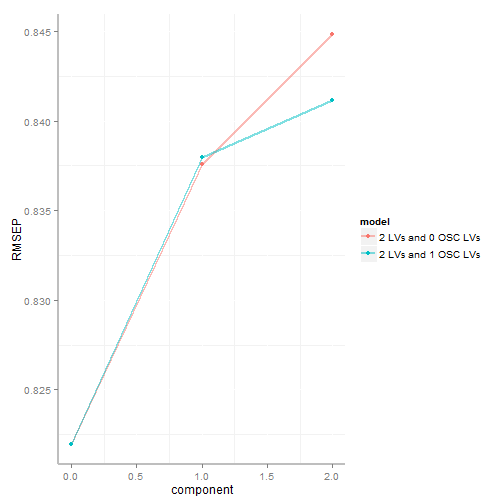
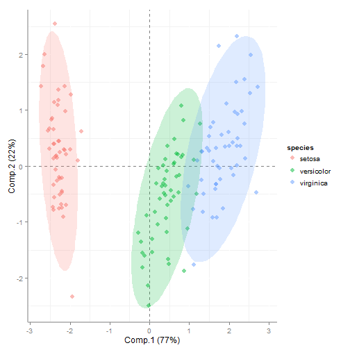
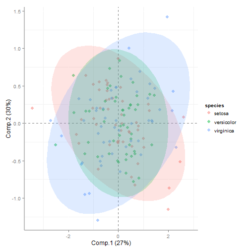

Data Covariate Adjustment
========================================================

Covariate adjustment is a widely used approach in statistical data analysis to improve the power of tests on independent variables. In this context, covariate adjustment plays an integral role the Analysis of Covariance (ANCOVA). However the reader should be warned that the valid application of ANCOVA makes a few assuptions. For a well written discussion of this topic the reader is directed [Misunderstanding Analysis of Covariance](http://www.ncbi.nlm.nih.gov/pubmed/11261398).

Covariate adjustment can also be a useful approach in data pre-processing in the context of multivariate modeling. The following is an example application of covariate adjustment using a linear model. The function [covar.adjustment](https://github.com/dgrapov/devium/blob/master/R/Devium%20Statistics.r) part of the [Devium](https://github.com/dgrapov/devium) tool set is used to carry out covariate adjustment on the famous [Iris](http://en.wikipedia.org/wiki/Iris_flower_data_set) data set.

Here are the major steps involved
- [loading Devium](#load) 
- [prepare Iris data](#prepare)
- [visualize raw data](#rawvis)
- [covariate adjust for Species](#covaradj)
- [visualize adjusted data](#adjvis)
- [conclusion](#conclusion)


<a name="load"/>
### Load Devium Library

```r
source("http://pastebin.com/raw.php?i=JVyTrYRD")  # source Devium
```


<a name="prepare"/>
### Prepare Iris data

```r
data(iris)
```


<a name="rawvis"/>
### Visualize raw data

```r
plot(data.frame(iris[, !colnames(iris) %in% "Species"]), pch = 21, bg = rainbow(nlevels(iris$Species), 
    alpha = 0.75)[iris$Species], cex = 2)
```

 

Note the difference in the relationship between Sepal.width and Sepal.length for different species of Iris. We may want to adjust all flower measurements to model this relationship independnet of species. However be warned this may be an invalid assumption (see Introduction).

<a name="covaradj"/>
### Create Species adjusted data

```r
factor <- iris$Species
formula <- "factor"
data <- iris[, !colnames(iris) %in% "Species"]
adj.iris <- covar.adjustment(data, formula)
```

The adjustment is done by creating a linear model for each variable and Species labels. The "Species" adjusted data is then the residuals from this model.

<a name="adjvis"/>
### Visualize data adjusted for Species differences

```r
plot(as.data.frame(adj.iris), pch = 21, bg = rainbow(nlevels(iris$Species), 
    alpha = 0.75)[iris$Species], cex = 2)
```

 

Now all the differences in the relationships among variables due to different species is removed (which may make no sense).
We can check this assumption on a multivariate basis using principal components analysis (PCA) and partial least squared discriminant analysis (O-PLS-DA).


### Principal Components Analysis (PCA)
Compare the PCA scores between the raw and covariate adjusted data.

```r
# set PCA defaults
pca.inputs <- list()
pca.inputs$pca.algorithm <- "svd"
pca.inputs$pca.components <- 2
pca.inputs$pca.center <- TRUE
pca.inputs$pca.scaling <- "uv"
pca.inputs$pca.cv <- "q2"

# calculate raw data PCA
pca.inputs$pca.data <- data
pca.raw <- devium.pca.calculate(pca.inputs, return = "list", plot = FALSE)

# adjusted data PCA
pca.inputs$pca.data <- adj.iris
pca.adj <- devium.pca.calculate(pca.inputs, return = "list", plot = FALSE)
```

### Plot PCA scores for both data sets
Raw data

```r
# plot.PCA(pca.raw, results =
# c('screeplot'),size=3,color=data.frame(species=factor), label=FALSE)
plot.PCA(pca.raw, results = c("scores"), size = 3, color = data.frame(species = factor), 
    label = FALSE)
```

 

Adjusted data

```r
# plot.PCA(pca.adj, results =
# c('screeplot'),size=3,color=data.frame(species=factor), label=FALSE)
plot.PCA(pca.adj, results = c("scores"), size = 3, color = data.frame(species = factor), 
    label = FALSE)
```

 

Comparison of the raw and adjusted scores first two principal components shows similarities in samples given all the variables. Proximity or distance between diffrent species scores can be directly translated to similarity or dissimilarity in measured values.
### O-PLS-DA
A similair example can be shown using a supervised projection method, orthogonal partial least squares discriminant analysis, which attempts to maximize the diffrences between species. Next we will fit O-PLS-DA models to discriminate species using the raw and adjusted data and overview these models error for species classfication and scores.

```r

groups <- data.frame(species = factor)
pls.y <- data.frame(as.numeric(groups[, 1]))

data <- data
scaled.data1 <- data.frame(scale(data, center = TRUE, scale = TRUE))
scaled.data2 <- data.frame(scale(adj.iris, center = TRUE, scale = TRUE))
# make models
mods1 <- make.OSC.PLS.model(pls.y, pls.data = scaled.data1, comp = 2, OSC.comp = 1, 
    validation = "LOO", method = "oscorespls", cv.scale = TRUE, return.obj = "stats", 
    progress = FALSE)
mods2 <- make.OSC.PLS.model(pls.y, pls.data = scaled.data2, comp = 2, OSC.comp = 1, 
    validation = "LOO", method = "oscorespls", cv.scale = TRUE, return.obj = "stats", 
    progress = FALSE)
```


View the error for the classfication of raw and adjusted data.
#### raw

```r
plot.OSC.results(mods1, plot = "RMSEP", groups = groups)
```

 

#### adjusted

```r
plot.OSC.results(mods2, plot = "RMSEP", groups = groups)
```

 

Now we see that after removing the variance in measurements due to diffrences between species our error of prediction gets very high, and is interstingly worse than what we would expect by random chance (RMSEP=0.5). Next we can compare the O-PLS-DA scores from these two models.
#### raw scores

```r
final <- get.OSC.model(obj = mods1, OSC.comp = 1)
plot.PLS(final, results = "scores", color = groups, label = FALSE)
```

 

#### adjusted scores

```r
final <- results <- get.OSC.model(obj = mods2, OSC.comp = 1)
plot.PLS(final, results = "scores", color = groups, label = FALSE)
```

 


<a name="conclusion"/>
### Conclusion of adjustment
In this simple example of covariate adjustment using a linear model all that is really happening is the intercept is now the same for all relationships/species. We can confirm this looking at all the pairwise relationships or on a multivariate exploratory level through PCA, or using the supervised approch of O-PLS-DA.


&copy; Dmitry Grapov (2014) <a rel="license" href="http://creativecommons.org/licenses/by-nc-sa/4.0/" target="_blank"></a>
