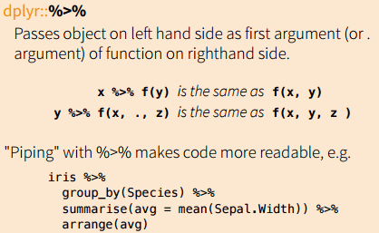
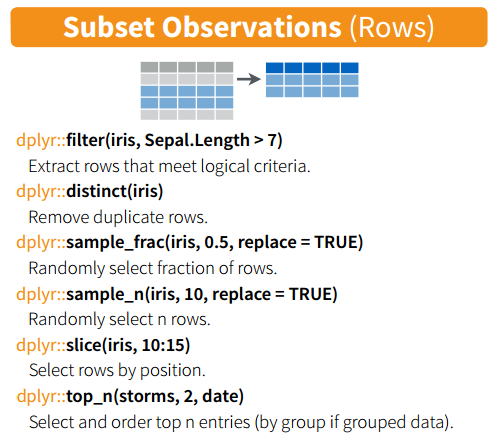
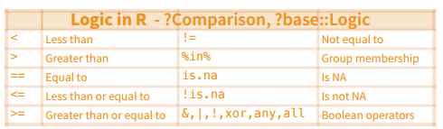
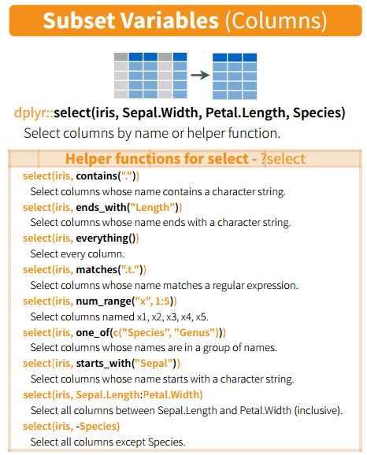
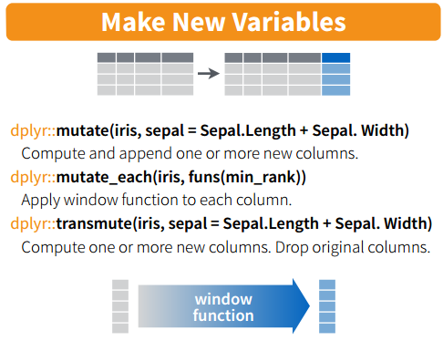
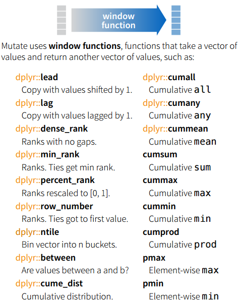
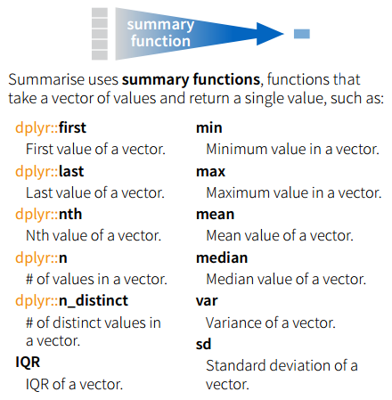
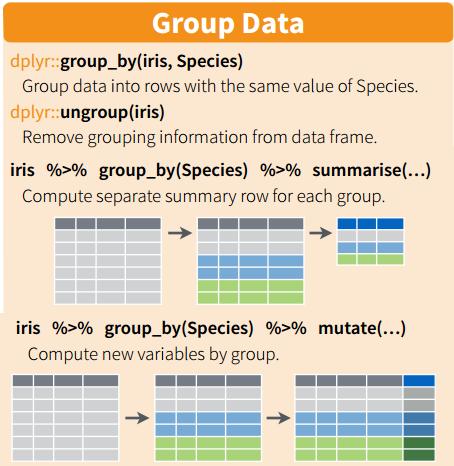
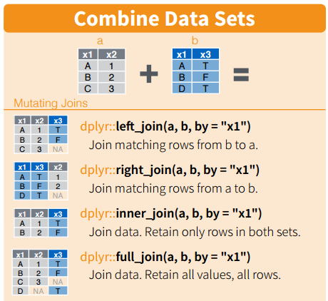
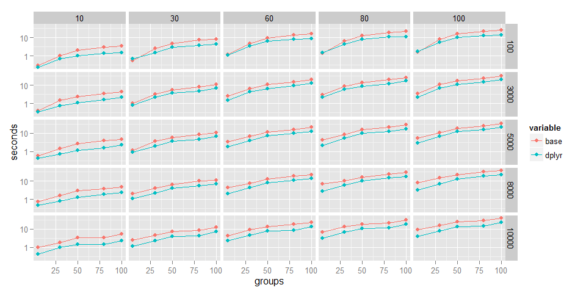

# Hands-on with dplyr
Dmitry Grapov  

## Introduction

This is meant to be an introduction to [dplyr](http://cran.r-project.org/web/packages/dplyr/index.html) which covers dplyr basics, gets into a little bit of programming with dplyr and ends with brief mention of some gotchas and a benchmarking comparison to base for the split-apply strategy. You might also find [Rstudio](http://www.rstudio.com/)'s [Data Wrangling Cheat Sheet](http://www.rstudio.com/wp-content/uploads/2015/02/data-wrangling-cheatsheet.pdf) featuring dplyr useful (this is also where I borrowed some of the images used in this tutorial).

The [dplyr](http://cran.r-project.org/web/packages/dplyr/index.html) package from [Hadley Wickham](http://had.co.nz/) is plain awesome. It features consistent and succinct syntax, is computationally fast and getting better with every release. The `dplyr` package has replaced many common more verbose R idioms which I had to previously rely upon for most common data analysis tasks. 

For example, many data analysis tasks involve the procedure of splitting the data set based on a grouping variable and then applying a function to each of the groups (split-apply). Lets say I want to calculate the median values for a few parameters for cars with different numbers of cylinders using the [mtcars](https://stat.ethz.ch/R-manual/R-devel/library/datasets/html/mtcars.html) data set. 

Set up the data for the example.

```r
#some data prep
data(mtcars)
data<-mtcars
data$cyl<-factor(data$cyl)
```

Split-lapply-apply in `base`: 

```r
#select some variable of interest
vars<-c("mpg","wt","qsec")
tmp.data<-data[,colnames(data)%in%vars]

#split the data on the number of cylinders
big.l<-split(tmp.data,data$cyl)

#apply some function of interest to all columns
results<-lapply(big.l, function(x) apply(x,2,median))

#bind results and add splitting info
data.frame(cyl=names(results),do.call("rbind",results))
```

```
##   cyl  mpg    wt   qsec
## 4   4 26.0 2.200 18.900
## 6   6 19.7 3.215 18.300
## 8   8 15.2 3.755 17.175
```

Now the same process using `dplyr`:

```r
suppressPackageStartupMessages(library(dplyr))

#variables of interest
vars<-c("mpg","wt","qsec")

data %>% group_by(cyl) %>% select(one_of(vars)) %>% summarise_each(funs(median(.)))
```

```
## Source: local data frame [3 x 4]
## 
##   cyl  mpg    wt   qsec
## 1   4 26.0 2.200 18.900
## 2   6 19.7 3.215 18.300
## 3   8 15.2 3.755 17.175
```

Switching from `base` to `dplyr` for data manipulation feels a little like this:

`base`  

`dplyr`

Each of the individual `dplyr` verbs are discussed in more detail below, but the use of `%>%` or the pipe operator is worth mentioning now. The `%>%` operator is imported from `magrittr` and for the purpose of this tutorial we can simply think of it as `then`. From the cheatsheet referenced above:


****

## Overview of common dplyr functions and verbs
 I highly recommend that you take a look at the `dplyr` [vignetts](http://cran.r-project.org/web/packages/dplyr/index.html) for more detailed description of all of this packages capabilities. 
One immediate addition in `dplyr` you might notice is  `tbl_df` which is a local data frame and mostly behaves like the classical `data.frame` but is more convenient for working with large data.

```r
tbl_df(mtcars)
```

```
## Source: local data frame [32 x 11]
## 
##     mpg cyl  disp  hp drat    wt  qsec vs am gear carb
## 1  21.0   6 160.0 110 3.90 2.620 16.46  0  1    4    4
## 2  21.0   6 160.0 110 3.90 2.875 17.02  0  1    4    4
## 3  22.8   4 108.0  93 3.85 2.320 18.61  1  1    4    1
## 4  21.4   6 258.0 110 3.08 3.215 19.44  1  0    3    1
## 5  18.7   8 360.0 175 3.15 3.440 17.02  0  0    3    2
## 6  18.1   6 225.0 105 2.76 3.460 20.22  1  0    3    1
## 7  14.3   8 360.0 245 3.21 3.570 15.84  0  0    3    4
## 8  24.4   4 146.7  62 3.69 3.190 20.00  1  0    4    2
## 9  22.8   4 140.8  95 3.92 3.150 22.90  1  0    4    2
## 10 19.2   6 167.6 123 3.92 3.440 18.30  1  0    4    4
## ..  ... ...   ... ...  ...   ...   ... .. ..  ...  ...
```

```r
# control the number of rows
print(tbl_df(mtcars),n=5)
```

```
## Source: local data frame [32 x 11]
## 
##     mpg cyl disp  hp drat    wt  qsec vs am gear carb
## 1  21.0   6  160 110 3.90 2.620 16.46  0  1    4    4
## 2  21.0   6  160 110 3.90 2.875 17.02  0  1    4    4
## 3  22.8   4  108  93 3.85 2.320 18.61  1  1    4    1
## 4  21.4   6  258 110 3.08 3.215 19.44  1  0    3    1
## 5  18.7   8  360 175 3.15 3.440 17.02  0  0    3    2
## ..  ... ...  ... ...  ...   ...   ... .. ..  ...  ...
```

You can can make sure all columns are output to the screen using `options(dplyr.width = Inf)`.
`glimpse` is another useful function which is an analogue of `str` but tries to show you more of the data.


```r
str(mtcars)
```

```
## 'data.frame':	32 obs. of  11 variables:
##  $ mpg : num  21 21 22.8 21.4 18.7 18.1 14.3 24.4 22.8 19.2 ...
##  $ cyl : num  6 6 4 6 8 6 8 4 4 6 ...
##  $ disp: num  160 160 108 258 360 ...
##  $ hp  : num  110 110 93 110 175 105 245 62 95 123 ...
##  $ drat: num  3.9 3.9 3.85 3.08 3.15 2.76 3.21 3.69 3.92 3.92 ...
##  $ wt  : num  2.62 2.88 2.32 3.21 3.44 ...
##  $ qsec: num  16.5 17 18.6 19.4 17 ...
##  $ vs  : num  0 0 1 1 0 1 0 1 1 1 ...
##  $ am  : num  1 1 1 0 0 0 0 0 0 0 ...
##  $ gear: num  4 4 4 3 3 3 3 4 4 4 ...
##  $ carb: num  4 4 1 1 2 1 4 2 2 4 ...
```

```r
glimpse(mtcars)
```

```
## Observations: 32
## Variables:
## $ mpg  (dbl) 21.0, 21.0, 22.8, 21.4, 18.7, 18.1, 14.3, 24.4, 22.8, 19....
## $ cyl  (dbl) 6, 6, 4, 6, 8, 6, 8, 4, 4, 6, 6, 8, 8, 8, 8, 8, 8, 4, 4, ...
## $ disp (dbl) 160.0, 160.0, 108.0, 258.0, 360.0, 225.0, 360.0, 146.7, 1...
## $ hp   (dbl) 110, 110, 93, 110, 175, 105, 245, 62, 95, 123, 123, 180, ...
## $ drat (dbl) 3.90, 3.90, 3.85, 3.08, 3.15, 2.76, 3.21, 3.69, 3.92, 3.9...
## $ wt   (dbl) 2.620, 2.875, 2.320, 3.215, 3.440, 3.460, 3.570, 3.190, 3...
## $ qsec (dbl) 16.46, 17.02, 18.61, 19.44, 17.02, 20.22, 15.84, 20.00, 2...
## $ vs   (dbl) 0, 0, 1, 1, 0, 1, 0, 1, 1, 1, 1, 0, 0, 0, 0, 0, 0, 1, 1, ...
## $ am   (dbl) 1, 1, 1, 0, 0, 0, 0, 0, 0, 0, 0, 0, 0, 0, 0, 0, 0, 1, 1, ...
## $ gear (dbl) 4, 4, 4, 3, 3, 3, 3, 4, 4, 4, 4, 3, 3, 3, 3, 3, 3, 4, 4, ...
## $ carb (dbl) 4, 4, 1, 1, 2, 1, 4, 2, 2, 4, 4, 3, 3, 3, 4, 4, 4, 1, 2, ...
```

For the purpose of this tutorial we will be mostly working with data.frames, however it should be noted that dplyr syntax abstracts away the need to specify the kind of object being manipulated and most everything we will cover can also be applied to interact with a variety of database objects. 

The most common `dplyr` functions also referred to as verbs are as follows (see more in the [introduction](http://cran.rstudio.com/web/packages/dplyr/vignettes/introduction.html) vignette):

* filter() and slice()
* arrange()
* select() and rename()
* mutate() and transmute()
* summarise()
* group_by()

The following commands will be demonstrated using the [hflights](http://cran.r-project.org/web/packages/hflights/index.html) data set.

```r
suppressPackageStartupMessages(library(hflights))
```

```
## Warning: package 'hflights' was built under R version 3.1.3
```

```r
(flights <- tbl_df(hflights))
```

```
## Source: local data frame [227,496 x 21]
## 
##    Year Month DayofMonth DayOfWeek DepTime ArrTime UniqueCarrier FlightNum
## 1  2011     1          1         6    1400    1500            AA       428
## 2  2011     1          2         7    1401    1501            AA       428
## 3  2011     1          3         1    1352    1502            AA       428
## 4  2011     1          4         2    1403    1513            AA       428
## 5  2011     1          5         3    1405    1507            AA       428
## 6  2011     1          6         4    1359    1503            AA       428
## 7  2011     1          7         5    1359    1509            AA       428
## 8  2011     1          8         6    1355    1454            AA       428
## 9  2011     1          9         7    1443    1554            AA       428
## 10 2011     1         10         1    1443    1553            AA       428
## ..  ...   ...        ...       ...     ...     ...           ...       ...
## Variables not shown: TailNum (chr), ActualElapsedTime (int), AirTime
##   (int), ArrDelay (int), DepDelay (int), Origin (chr), Dest (chr),
##   Distance (int), TaxiIn (int), TaxiOut (int), Cancelled (int),
##   CancellationCode (chr), Diverted (int)
```
Which contains 227496 records for 21 variables for flights departing Houston airport for 2011.

### Filter
Use `filter` to keep or select rows matching some criteria or condition(s).


`base`

```r
flights[flights$Month == 1 & flights$DayofMonth == 1, ]
```

```
## Source: local data frame [552 x 21]
## 
##    Year Month DayofMonth DayOfWeek DepTime ArrTime UniqueCarrier FlightNum
## 1  2011     1          1         6    1400    1500            AA       428
## 2  2011     1          1         6     728     840            AA       460
## 3  2011     1          1         6    1631    1736            AA      1121
## 4  2011     1          1         6    1756    2112            AA      1294
## 5  2011     1          1         6    1012    1347            AA      1700
## 6  2011     1          1         6    1211    1325            AA      1820
## 7  2011     1          1         6     557     906            AA      1994
## 8  2011     1          1         6    1824    2106            AS       731
## 9  2011     1          1         6     654    1124            B6       620
## 10 2011     1          1         6    1639    2110            B6       622
## ..  ...   ...        ...       ...     ...     ...           ...       ...
## Variables not shown: TailNum (chr), ActualElapsedTime (int), AirTime
##   (int), ArrDelay (int), DepDelay (int), Origin (chr), Dest (chr),
##   Distance (int), TaxiIn (int), TaxiOut (int), Cancelled (int),
##   CancellationCode (chr), Diverted (int)
```

```r
#could have also used subset
subset(flights, Month == 1 & DayofMonth == 1)
```

```
## Source: local data frame [552 x 21]
## 
##    Year Month DayofMonth DayOfWeek DepTime ArrTime UniqueCarrier FlightNum
## 1  2011     1          1         6    1400    1500            AA       428
## 2  2011     1          1         6     728     840            AA       460
## 3  2011     1          1         6    1631    1736            AA      1121
## 4  2011     1          1         6    1756    2112            AA      1294
## 5  2011     1          1         6    1012    1347            AA      1700
## 6  2011     1          1         6    1211    1325            AA      1820
## 7  2011     1          1         6     557     906            AA      1994
## 8  2011     1          1         6    1824    2106            AS       731
## 9  2011     1          1         6     654    1124            B6       620
## 10 2011     1          1         6    1639    2110            B6       622
## ..  ...   ...        ...       ...     ...     ...           ...       ...
## Variables not shown: TailNum (chr), ActualElapsedTime (int), AirTime
##   (int), ArrDelay (int), DepDelay (int), Origin (chr), Dest (chr),
##   Distance (int), TaxiIn (int), TaxiOut (int), Cancelled (int),
##   CancellationCode (chr), Diverted (int)
```

```r
#be wary of using subset programmatically: http://stackoverflow.com/questions/9860090/in-r-why-is-better-than-subset
```

`dplyr`

```r
#comma is the same as an ampersand (&)
filter(flights, Month == 1, DayofMonth == 1)
```

```
## Source: local data frame [552 x 21]
## 
##    Year Month DayofMonth DayOfWeek DepTime ArrTime UniqueCarrier FlightNum
## 1  2011     1          1         6    1400    1500            AA       428
## 2  2011     1          1         6     728     840            AA       460
## 3  2011     1          1         6    1631    1736            AA      1121
## 4  2011     1          1         6    1756    2112            AA      1294
## 5  2011     1          1         6    1012    1347            AA      1700
## 6  2011     1          1         6    1211    1325            AA      1820
## 7  2011     1          1         6     557     906            AA      1994
## 8  2011     1          1         6    1824    2106            AS       731
## 9  2011     1          1         6     654    1124            B6       620
## 10 2011     1          1         6    1639    2110            B6       622
## ..  ...   ...        ...       ...     ...     ...           ...       ...
## Variables not shown: TailNum (chr), ActualElapsedTime (int), AirTime
##   (int), ArrDelay (int), DepDelay (int), Origin (chr), Dest (chr),
##   Distance (int), TaxiIn (int), TaxiOut (int), Cancelled (int),
##   CancellationCode (chr), Diverted (int)
```

```r
# use pipe(|) for or
filter(flights, Month == 1 | DayofMonth == 1)
```

```
## Source: local data frame [25,769 x 21]
## 
##    Year Month DayofMonth DayOfWeek DepTime ArrTime UniqueCarrier FlightNum
## 1  2011     1          1         6    1400    1500            AA       428
## 2  2011     1          2         7    1401    1501            AA       428
## 3  2011     1          3         1    1352    1502            AA       428
## 4  2011     1          4         2    1403    1513            AA       428
## 5  2011     1          5         3    1405    1507            AA       428
## 6  2011     1          6         4    1359    1503            AA       428
## 7  2011     1          7         5    1359    1509            AA       428
## 8  2011     1          8         6    1355    1454            AA       428
## 9  2011     1          9         7    1443    1554            AA       428
## 10 2011     1         10         1    1443    1553            AA       428
## ..  ...   ...        ...       ...     ...     ...           ...       ...
## Variables not shown: TailNum (chr), ActualElapsedTime (int), AirTime
##   (int), ArrDelay (int), DepDelay (int), Origin (chr), Dest (chr),
##   Distance (int), TaxiIn (int), TaxiOut (int), Cancelled (int),
##   CancellationCode (chr), Diverted (int)
```

We can also include any of the following operators in filter.



Slice is a variant of filter used to extract rows based on position.

`base`

```r
flights[1:10,]
```

```
## Source: local data frame [10 x 21]
## 
##    Year Month DayofMonth DayOfWeek DepTime ArrTime UniqueCarrier FlightNum
## 1  2011     1          1         6    1400    1500            AA       428
## 2  2011     1          2         7    1401    1501            AA       428
## 3  2011     1          3         1    1352    1502            AA       428
## 4  2011     1          4         2    1403    1513            AA       428
## 5  2011     1          5         3    1405    1507            AA       428
## 6  2011     1          6         4    1359    1503            AA       428
## 7  2011     1          7         5    1359    1509            AA       428
## 8  2011     1          8         6    1355    1454            AA       428
## 9  2011     1          9         7    1443    1554            AA       428
## 10 2011     1         10         1    1443    1553            AA       428
## Variables not shown: TailNum (chr), ActualElapsedTime (int), AirTime
##   (int), ArrDelay (int), DepDelay (int), Origin (chr), Dest (chr),
##   Distance (int), TaxiIn (int), TaxiOut (int), Cancelled (int),
##   CancellationCode (chr), Diverted (int)
```

`dplyr`

```r
slice(flights, 1:10)
```

```
## Source: local data frame [10 x 21]
## 
##    Year Month DayofMonth DayOfWeek DepTime ArrTime UniqueCarrier FlightNum
## 1  2011     1          1         6    1400    1500            AA       428
## 2  2011     1          2         7    1401    1501            AA       428
## 3  2011     1          3         1    1352    1502            AA       428
## 4  2011     1          4         2    1403    1513            AA       428
## 5  2011     1          5         3    1405    1507            AA       428
## 6  2011     1          6         4    1359    1503            AA       428
## 7  2011     1          7         5    1359    1509            AA       428
## 8  2011     1          8         6    1355    1454            AA       428
## 9  2011     1          9         7    1443    1554            AA       428
## 10 2011     1         10         1    1443    1553            AA       428
## Variables not shown: TailNum (chr), ActualElapsedTime (int), AirTime
##   (int), ArrDelay (int), DepDelay (int), Origin (chr), Dest (chr),
##   Distance (int), TaxiIn (int), TaxiOut (int), Cancelled (int),
##   CancellationCode (chr), Diverted (int)
```

****

## Arrange
Order data based on specified columns.

`base`

```r
flights[order(flights$Month),]
```

```
## Source: local data frame [227,496 x 21]
## 
##    Year Month DayofMonth DayOfWeek DepTime ArrTime UniqueCarrier FlightNum
## 1  2011     1          1         6    1400    1500            AA       428
## 2  2011     1          2         7    1401    1501            AA       428
## 3  2011     1          3         1    1352    1502            AA       428
## 4  2011     1          4         2    1403    1513            AA       428
## 5  2011     1          5         3    1405    1507            AA       428
## 6  2011     1          6         4    1359    1503            AA       428
## 7  2011     1          7         5    1359    1509            AA       428
## 8  2011     1          8         6    1355    1454            AA       428
## 9  2011     1          9         7    1443    1554            AA       428
## 10 2011     1         10         1    1443    1553            AA       428
## ..  ...   ...        ...       ...     ...     ...           ...       ...
## Variables not shown: TailNum (chr), ActualElapsedTime (int), AirTime
##   (int), ArrDelay (int), DepDelay (int), Origin (chr), Dest (chr),
##   Distance (int), TaxiIn (int), TaxiOut (int), Cancelled (int),
##   CancellationCode (chr), Diverted (int)
```

`dplyr`

```r
arrange(flights,Month)
```

```
## Source: local data frame [227,496 x 21]
## 
##    Year Month DayofMonth DayOfWeek DepTime ArrTime UniqueCarrier FlightNum
## 1  2011     1          1         6    1400    1500            AA       428
## 2  2011     1          2         7    1401    1501            AA       428
## 3  2011     1          3         1    1352    1502            AA       428
## 4  2011     1          4         2    1403    1513            AA       428
## 5  2011     1          5         3    1405    1507            AA       428
## 6  2011     1          6         4    1359    1503            AA       428
## 7  2011     1          7         5    1359    1509            AA       428
## 8  2011     1          8         6    1355    1454            AA       428
## 9  2011     1          9         7    1443    1554            AA       428
## 10 2011     1         10         1    1443    1553            AA       428
## ..  ...   ...        ...       ...     ...     ...           ...       ...
## Variables not shown: TailNum (chr), ActualElapsedTime (int), AirTime
##   (int), ArrDelay (int), DepDelay (int), Origin (chr), Dest (chr),
##   Distance (int), TaxiIn (int), TaxiOut (int), Cancelled (int),
##   CancellationCode (chr), Diverted (int)
```

```r
#decreasing order
arrange(flights,desc(Month))
```

```
## Source: local data frame [227,496 x 21]
## 
##    Year Month DayofMonth DayOfWeek DepTime ArrTime UniqueCarrier FlightNum
## 1  2011    12         15         4    2113    2217            AA       426
## 2  2011    12         16         5    2004    2128            AA       426
## 3  2011    12         18         7    2007    2113            AA       426
## 4  2011    12         19         1    2108    2223            AA       426
## 5  2011    12         20         2    2008    2107            AA       426
## 6  2011    12         21         3    2025    2124            AA       426
## 7  2011    12         22         4    2021    2118            AA       426
## 8  2011    12         23         5    2015    2118            AA       426
## 9  2011    12         26         1    2013    2118            AA       426
## 10 2011    12         27         2    2007    2123            AA       426
## ..  ...   ...        ...       ...     ...     ...           ...       ...
## Variables not shown: TailNum (chr), ActualElapsedTime (int), AirTime
##   (int), ArrDelay (int), DepDelay (int), Origin (chr), Dest (chr),
##   Distance (int), TaxiIn (int), TaxiOut (int), Cancelled (int),
##   CancellationCode (chr), Diverted (int)
```

```r
#break ties using more columns
arrange(flights,desc(Month),DayOfWeek)
```

```
## Source: local data frame [227,496 x 21]
## 
##    Year Month DayofMonth DayOfWeek DepTime ArrTime UniqueCarrier FlightNum
## 1  2011    12         19         1    2108    2223            AA       426
## 2  2011    12         26         1    2013    2118            AA       426
## 3  2011    12          5         1     558     926            AA       466
## 4  2011    12         12         1     609     921            AA       466
## 5  2011    12         19         1     603     913            AA       466
## 6  2011    12         26         1     558     912            AA       466
## 7  2011    12          5         1    1206    1311            AA       865
## 8  2011    12         12         1    1339    1436            AA       865
## 9  2011    12         19         1    1203    1314            AA       865
## 10 2011    12         26         1    1200    1318            AA       865
## ..  ...   ...        ...       ...     ...     ...           ...       ...
## Variables not shown: TailNum (chr), ActualElapsedTime (int), AirTime
##   (int), ArrDelay (int), DepDelay (int), Origin (chr), Dest (chr),
##   Distance (int), TaxiIn (int), TaxiOut (int), Cancelled (int),
##   CancellationCode (chr), Diverted (int)
```

****

### Select
Select columns from the data.

`base`

```r
flights[,colnames(flights)%in%c("Month","DayOfWeek")]
```

```
## Source: local data frame [227,496 x 2]
## 
##    Month DayOfWeek
## 1      1         6
## 2      1         7
## 3      1         1
## 4      1         2
## 5      1         3
## 6      1         4
## 7      1         5
## 8      1         6
## 9      1         7
## 10     1         1
## ..   ...       ...
```

`dplyr`

```r
select(flights,Month,DayOfWeek)
```

```
## Source: local data frame [227,496 x 2]
## 
##    Month DayOfWeek
## 1      1         6
## 2      1         7
## 3      1         1
## 4      1         2
## 5      1         3
## 6      1         4
## 7      1         5
## 8      1         6
## 9      1         7
## 10     1         1
## ..   ...       ...
```

```r
#select using a dynamic variable
variables<-c("Month","DayOfWeek")
select(flights,one_of(variables))
```

```
## Source: local data frame [227,496 x 2]
## 
##    Month DayOfWeek
## 1      1         6
## 2      1         7
## 3      1         1
## 4      1         2
## 5      1         3
## 6      1         4
## 7      1         5
## 8      1         6
## 9      1         7
## 10     1         1
## ..   ...       ...
```

```r
#remove variables
select(flights,one_of(variables),-Month)
```

```
## Source: local data frame [227,496 x 1]
## 
##    DayOfWeek
## 1          6
## 2          7
## 3          1
## 4          2
## 5          3
## 6          4
## 7          5
## 8          6
## 9          7
## 10         1
## ..       ...
```

Select also provides many regular expression wrappers.



Use `rename` to change column names.

```r
rename(flights,diverted=Diverted)
```

```
## Source: local data frame [227,496 x 21]
## 
##    Year Month DayofMonth DayOfWeek DepTime ArrTime UniqueCarrier FlightNum
## 1  2011     1          1         6    1400    1500            AA       428
## 2  2011     1          2         7    1401    1501            AA       428
## 3  2011     1          3         1    1352    1502            AA       428
## 4  2011     1          4         2    1403    1513            AA       428
## 5  2011     1          5         3    1405    1507            AA       428
## 6  2011     1          6         4    1359    1503            AA       428
## 7  2011     1          7         5    1359    1509            AA       428
## 8  2011     1          8         6    1355    1454            AA       428
## 9  2011     1          9         7    1443    1554            AA       428
## 10 2011     1         10         1    1443    1553            AA       428
## ..  ...   ...        ...       ...     ...     ...           ...       ...
## Variables not shown: TailNum (chr), ActualElapsedTime (int), AirTime
##   (int), ArrDelay (int), DepDelay (int), Origin (chr), Dest (chr),
##   Distance (int), TaxiIn (int), TaxiOut (int), Cancelled (int),
##   CancellationCode (chr), diverted (int)
```

****

### Mutate and Transmute
Use theses verbs to create a new column variable which in the case of `mutate` will be added to the or created as a stand-alone variables `transmute`. 



Lets calculate the wait time based on the difference between `ArrTime` and `DepTime`.

`base`

```r
#transmute like
head(wait<-flights$ArrTime - flights$DepTime)
```

```
## [1] 100 100 150 110 102 144
```

```r
#mutate like
head(flights2<-cbind(flights,wait))
```

```
##   Year Month DayofMonth DayOfWeek DepTime ArrTime UniqueCarrier FlightNum
## 1 2011     1          1         6    1400    1500            AA       428
## 2 2011     1          2         7    1401    1501            AA       428
## 3 2011     1          3         1    1352    1502            AA       428
## 4 2011     1          4         2    1403    1513            AA       428
## 5 2011     1          5         3    1405    1507            AA       428
## 6 2011     1          6         4    1359    1503            AA       428
##   TailNum ActualElapsedTime AirTime ArrDelay DepDelay Origin Dest Distance
## 1  N576AA                60      40      -10        0    IAH  DFW      224
## 2  N557AA                60      45       -9        1    IAH  DFW      224
## 3  N541AA                70      48       -8       -8    IAH  DFW      224
## 4  N403AA                70      39        3        3    IAH  DFW      224
## 5  N492AA                62      44       -3        5    IAH  DFW      224
## 6  N262AA                64      45       -7       -1    IAH  DFW      224
##   TaxiIn TaxiOut Cancelled CancellationCode Diverted wait
## 1      7      13         0                         0  100
## 2      6       9         0                         0  100
## 3      5      17         0                         0  150
## 4      9      22         0                         0  110
## 5      9       9         0                         0  102
## 6      6      13         0                         0  144
```

`dplyr`

```r
#stand alone
transmute(flights,diff = ArrTime - DepTime)
```

```
## Source: local data frame [227,496 x 1]
## 
##    diff
## 1   100
## 2   100
## 3   150
## 4   110
## 5   102
## 6   144
## 7   150
## 8    99
## 9   111
## 10  110
## ..  ...
```

```r
#added to data
mutate(flights,diff = ArrTime - DepTime)
```

```
## Source: local data frame [227,496 x 22]
## 
##    Year Month DayofMonth DayOfWeek DepTime ArrTime UniqueCarrier FlightNum
## 1  2011     1          1         6    1400    1500            AA       428
## 2  2011     1          2         7    1401    1501            AA       428
## 3  2011     1          3         1    1352    1502            AA       428
## 4  2011     1          4         2    1403    1513            AA       428
## 5  2011     1          5         3    1405    1507            AA       428
## 6  2011     1          6         4    1359    1503            AA       428
## 7  2011     1          7         5    1359    1509            AA       428
## 8  2011     1          8         6    1355    1454            AA       428
## 9  2011     1          9         7    1443    1554            AA       428
## 10 2011     1         10         1    1443    1553            AA       428
## ..  ...   ...        ...       ...     ...     ...           ...       ...
## Variables not shown: TailNum (chr), ActualElapsedTime (int), AirTime
##   (int), ArrDelay (int), DepDelay (int), Origin (chr), Dest (chr),
##   Distance (int), TaxiIn (int), TaxiOut (int), Cancelled (int),
##   CancellationCode (chr), Diverted (int), diff (int)
```

Many dplyr functions will let you use newly create variables in the same function which is creating the variable in the first place.


```r
transmute(flights,diff = ArrTime - DepTime, ratio = ArrTime/diff, ratio2 = diff/ratio)
```

```
## Source: local data frame [227,496 x 3]
## 
##    diff    ratio    ratio2
## 1   100 15.00000  6.666667
## 2   100 15.01000  6.662225
## 3   150 10.01333 14.980027
## 4   110 13.75455  7.997356
## 5   102 14.77451  6.903782
## 6   144 10.43750 13.796407
## 7   150 10.06000 14.910537
## 8    99 14.68687  6.740715
## 9   111 14.00000  7.928571
## 10  110 14.11818  7.791372
## ..  ...      ...       ...
```

The `mutate_each` function can be used to apply a function to every column in the dataframe. Lets bin each column into quartiles using the `ntile` function.

```r
glimpse(mutate_each(flights,funs(ntile(.,n=4))))
```

```
## Observations: 227496
## Variables:
## $ Year              (int) 1, 1, 1, 1, 1, 1, 1, 1, 1, 1, 1, 1, 1, 1, 1,...
## $ Month             (int) 1, 1, 1, 1, 1, 1, 1, 1, 1, 1, 1, 1, 1, 1, 1,...
## $ DayofMonth        (int) 1, 1, 1, 1, 1, 1, 1, 1, 2, 2, 2, 2, 2, 2, 2,...
## $ DayOfWeek         (int) 3, 4, 1, 1, 2, 2, 3, 3, 4, 1, 1, 2, 2, 3, 3,...
## $ DepTime           (int) 2, 2, 2, 2, 2, 2, 2, 2, 3, 3, 3, 3, 2, 2, 2,...
## $ ArrTime           (int) 2, 2, 2, 2, 2, 2, 2, 2, 2, 2, 2, 2, 2, 2, 2,...
## $ UniqueCarrier     (int) 1, 1, 1, 1, 1, 1, 1, 1, 1, 1, 1, 1, 1, 1, 1,...
## $ FlightNum         (int) 1, 1, 1, 1, 1, 1, 1, 1, 1, 1, 1, 1, 1, 1, 1,...
## $ TailNum           (int) 3, 3, 3, 3, 3, 2, 3, 3, 3, 3, 3, 3, 3, 3, 3,...
## $ ActualElapsedTime (int) 1, 1, 1, 1, 1, 1, 1, 1, 1, 1, 1, 1, 1, 1, 1,...
## $ AirTime           (int) 1, 1, 1, 1, 1, 1, 1, 1, 1, 1, 1, 1, 1, 1, 1,...
## $ ArrDelay          (int) 1, 1, 1, 3, 2, 2, 2, 1, 4, 4, 4, 3, 1, 2, 1,...
## $ DepDelay          (int) 2, 3, 1, 3, 3, 2, 2, 1, 4, 4, 4, 4, 2, 1, 2,...
## $ Origin            (int) 1, 1, 1, 1, 1, 1, 1, 1, 1, 1, 1, 1, 1, 1, 1,...
## $ Dest              (int) 2, 2, 2, 2, 2, 2, 2, 2, 2, 2, 2, 2, 2, 2, 2,...
## $ Distance          (int) 1, 1, 1, 1, 1, 1, 1, 1, 1, 1, 1, 1, 1, 1, 1,...
## $ TaxiIn            (int) 3, 3, 2, 4, 4, 3, 4, 3, 4, 3, 4, 1, 3, 2, 3,...
## $ TaxiOut           (int) 2, 1, 3, 4, 1, 2, 3, 2, 4, 4, 4, 2, 2, 3, 1,...
## $ Cancelled         (int) 1, 1, 1, 1, 1, 1, 1, 1, 1, 1, 1, 1, 1, 1, 1,...
## $ CancellationCode  (int) 1, 1, 1, 1, 1, 1, 1, 1, 1, 1, 1, 1, 1, 1, 1,...
## $ Diverted          (int) 1, 1, 1, 1, 1, 1, 1, 1, 1, 1, 1, 1, 1, 1, 1,...
```

Here is a list of some other `dplyr` convenience functions.



****

### Summarise
Carry out a function on the data frame returning a single value.


Lets calculate the range for wait times and use this as an opportunity to involve `%>%`.

```r
transmute(flights,diff = ArrTime - DepTime) %>% summarise(.,min=min(diff,na.rm=TRUE),max=max(diff,na.rm=TRUE))
```

```
## Source: local data frame [1 x 2]
## 
##     min  max
## 1 -2322 1350
```

Either we just discovered time travel or we should have been referencing the day and time in our calculation of the difference between arrival and departure. Lets count how many calculations we may have screwed up.


```r
(bad<-transmute(flights,diff = ArrTime - DepTime) %>% filter(diff<0) %>% count(.))
```

```
## Source: local data frame [1 x 1]
## 
##      n
## 1 2718
```
An error rate of 1.2 %may or may not be acceptable.

We can use `summarise_each` to apply a function to every column in the data set. Lets calculate the median and median absolute deviation for every numeric variable.

```r
vars<-colnames(flights)[sapply(flights,is.numeric)]
flights %>% select(one_of(vars)) %>% summarise_each(.,funs(median=median(.,na.rm=TRUE),mad=mad(.,na.rm=TRUE)))
```

```
## Source: local data frame [1 x 32]
## 
##   Year_median Month_median DayofMonth_median DayOfWeek_median
## 1        2011            7                16                4
## Variables not shown: DepTime_median (int), ArrTime_median (dbl),
##   FlightNum_median (dbl), ActualElapsedTime_median (dbl), AirTime_median
##   (dbl), ArrDelay_median (dbl), DepDelay_median (int), Distance_median
##   (dbl), TaxiIn_median (dbl), TaxiOut_median (int), Cancelled_median
##   (dbl), Diverted_median (dbl), Year_mad (dbl), Month_mad (dbl),
##   DayofMonth_mad (dbl), DayOfWeek_mad (dbl), DepTime_mad (dbl),
##   ArrTime_mad (dbl), FlightNum_mad (dbl), ActualElapsedTime_mad (dbl),
##   AirTime_mad (dbl), ArrDelay_mad (dbl), DepDelay_mad (dbl), Distance_mad
##   (dbl), TaxiIn_mad (dbl), TaxiOut_mad (dbl), Cancelled_mad (dbl),
##   Diverted_mad (dbl)
```

Here are some additional functions which can be used with summarise.



*****
##Group_by
Break the data sets into groups of rows.



`group_by` adds the final piece of the puzzle we need to execute the split-apply strategy to our hearts content. This function becomes very powerful when combined with the previously discussed `dplyr` verbs. For example lets calculate which day of the week has the most cancellations.


```r
flights %>% group_by(DayOfWeek) %>% 
  select(Cancelled)  %>% summarise_each(funs(canceled=sum(.,na.rm=TRUE),
                                             total=n(),
                                             percent_cancelled=round(canceled/total*100,1)))
```

```
## Source: local data frame [7 x 4]
## 
##   DayOfWeek canceled total percent_cancelled
## 1         1      344 34360               1.0
## 2         2      369 31649               1.2
## 3         3      396 31926               1.2
## 4         4      616 34902               1.8
## 5         5      663 34972               1.9
## 6         6      272 27629               1.0
## 7         7      313 32058               1.0
```

We can also use `group_by` to generate groups using more than one variable. For example lets calculate the median `AirTime` times by `Distance` and `TailNum`.

```r
(slowest<-flights %>% group_by(Distance,TailNum) %>% 
  select(AirTime)  %>% summarise_each(funs(mean(.,na.rm=TRUE))))
```

```
## Source: local data frame [44,698 x 3]
## Groups: Distance
## 
##    Distance TailNum  AirTime
## 1        79  N14940 30.00000
## 2        79  N14943 29.00000
## 3        79  N17928 22.00000
## 4       127              NaN
## 5       127  N11106 29.00000
## 6       127  N11107 24.00000
## 7       127  N11155 26.00000
## 8       127  N11187 25.00000
## 9       127  N11189 26.00000
## 10      127  N11535 27.33333
## ..      ...     ...      ...
```

Lets identify the 3 slowest and fastest planes based on `AirTime` for some arbitrary `Distance`.

```r
#choose arbitrary distance
tmp<-slowest %>% na.omit(.) %>% 
  filter(.,Distance==781) %>%
  arrange(AirTime)

#not clear why, but the results can't be bound directly
tmp %>% head(.,3)
```

```
## Source: local data frame [3 x 3]
## Groups: Distance
## 
##   Distance TailNum AirTime
## 1      781  N275WN      85
## 2      781  N453WN      87
## 3      781  N725SW      88
```

```r
tmp %>% tail(.,3) %>% arrange(desc(.))
```

```
## Source: local data frame [3 x 3]
## Groups: Distance
## 
##   Distance TailNum AirTime
## 1      781  N474WN     155
## 2      781  N16646     127
## 3      781  N14653     139
```

A common data analysis task might be to carry out some group-wise normalization or adjustments of the data. For example we may want to calculate the day of the week with the slowest flights, but also adjust for differences between individual planes. To do this we will start by calculating the average speed for each plane.


```r
#calculate speed
flights<-flights %>% mutate(hrs=AirTime/60, speed=Distance/hrs)

(averages<-flights %>%
  group_by(TailNum) %>% 
  select(.,speed) %>%
  summarise_each(funs(mean(.,na.rm=TRUE))) %>% 
  rename(.,mean_speed=speed))
```

```
## Source: local data frame [3,320 x 2]
## 
##    TailNum mean_speed
## 1                 NaN
## 2   N0EGMQ   462.9232
## 3   N10156   441.9362
## 4   N10575   413.5374
## 5   N11106   436.8909
## 6   N11107   437.8388
## 7   N11109   434.9298
## 8   N11113   438.9109
## 9   N11119   441.4825
## 10  N11121   436.0297
## ..     ...        ...
```

Next lets express the overall speed for each plane as ratio to the mean plane speed. To do this we will use one of the powerful join capabilities in `dplyr`.



We will join with the original data set based on `TailNum` and calculate the plane-adjusted measure of speed.


```r
right_join(flights,averages,by="TailNum") %>%
  mutate(norm_speed = speed / mean_speed) %>% 
  group_by(DayOfWeek) %>% 
  select(contains("speed")) %>%
  summarise_each(funs(mean(.,na.rm=TRUE)))
```

```
## Source: local data frame [7 x 4]
## 
##   DayOfWeek    speed mean_speed norm_speed
## 1         1 419.2984   420.5830  0.9965149
## 2         2 418.2220   420.4509  0.9942130
## 3         3 419.2926   420.4236  0.9968347
## 4         4 420.3597   420.3783  0.9995784
## 5         5 419.9916   420.4688  0.9985305
## 6         6 427.3059   422.7704  1.0107539
## 7         7 423.7673   421.4198  1.0053550
```

So if things worked out like we expected it looks like Saturday flights are fastest and Tuesday the slowest.

### Using dplyr programmatically
Most of the examples up to this point featured using `dplyr` in interactive mode. However there are variants of nearly every verb which are best suited for use inside other functions. To see what theses are take a look at `verb_` versions of each function (e.g. `summarise_`).

### Benchmarking split-apply in base and dplyr
Finally I will wrap with a relatively non-sophisticated benchmarking head-to-head comparison of `base` and `dplyr` speed for the almighty split-apply strategy.

Lets set up the data.

```r
rows<-10000
cols<-100
groups<-100
samples<-rows/groups
tmp.data<-data.frame(matrix(rnorm(rows),rows,cols))
tmp.data$group<-rep(1:groups,each=samples)
```

This data set has 10^{4} rows, 100 columns and 100 groups with 100 samples each.

`base` 

```r
ptm <- Sys.time()
#split the data on the number of cylinders
big.l<-split(tmp.data,tmp.data$group)

#apply some function of interest to all columns
results<-lapply(big.l, function(x) apply(x,2,median))

#bind results and add splitting info
results<-data.frame(group=names(results),do.call("rbind",results))

#elapsed time
(bd<-Sys.time()-ptm )
```

```
## Time difference of 0.5802019 secs
```

`dplyr` 

```r
ptm <- Sys.time()

results<-tmp.data %>% group_by(group) %>% summarise_each(funs(median(.)))

#elapsed time
(ad<-Sys.time()-ptm )
```

```
## Time difference of 0.3492 secs
```

Wow I just saved 0.2310019 seconds  of my life!


Create a benchmark visualization comparing base to dplyr for differing number of groups, rows and columns. Uncomment the code in the appendix below and modify as needed to re-run the benchmark.

```r
load(file="benchmark results")

#create a plot
library(reshape2)
library(ggplot2)
tmp.data<-melt(res,id.vars=c("rows","columns","groups","samples")) %>% mutate(seconds=value*60)

ggplot(tmp.data, aes(y=seconds,x=groups,group=variable,color=variable)) + geom_line() +geom_point()+ facet_grid(rows ~ columns) +scale_y_log10()
```

 

The plot above shows the calculation time for 10 replications in seconds (y-axis) for calculating the median of varying number of groups (x-axis), rows (y-facet) and columns (y-facet).

*****

### Gotchas
1. In `dplyr` rownames are a second class citizen and are not stored.
2. Even though nearly every `dplyr` tutorial features pipes (`%>%`) it may be easier to learn both `dplyr` and `%>%` separately.
3. Most `dplyr` functions only work on objects coercible to ~ `data.frames`. Lots of my debugging sessions start with trying to understand the data structure of objects I am passing to `dplyr`. 

*****

### Appendix

```r
# 
# #set up functions to time
# base_fun<-function(data){
#       #split the data on the number of cylinders
#     big.l<-split(data,data$group)
#     
#     #apply some function of interest to all columns
#     results<-lapply(big.l, function(x) apply(x,2,median))
#     
#     #bind results and add splitting info
#     data.frame(group=names(results),do.call("rbind",results))
# }
# 
# dplyr_fun<-function(data){
#   
#   data %>% group_by(group) %>% summarise_each(funs(median(.)))
# }
# 
# #benchmark function
# benchmark_fun<-function(rows,cols,groups){
#   
#   #set up data
#   samples<-floor(rows/groups)
#   tmp.data<-data.frame(matrix(rnorm(rows),rows,cols))
#   tmp.data$group<-rep(1:groups,length.out=rows)
#   
#   #base
#   base.time<-system.time(replicate(10,base_fun(tmp.data)))
#   
#   #dplyr
#   dplyr.time<-system.time(replicate(10,dplyr_fun(tmp.data)))
#   
#   data.frame(rows=rows,columns=cols,groups=groups,samples=samples,base=signif(base.time["elapsed"]/10,3),dplyr=signif(dplyr.time["elapsed"]/10,3))
#   
# }
# 
# #run benchmarks
# len<-5
# groups<-seq(5, 100,length.out=len) %>% signif(.,0)
# rows<-seq(100, 10000,length.out=len) %>% signif(.,0)
# cols<-seq(10, 100,length.out=len) %>% signif(.,0)
# 
# #benchmarks
# results<-list()
# counter<-1
# for(i in 1:length(groups)){ 
#   .group<-groups[i]
#   for(j in 1:length(rows)){
#     .row<-rows[j]
#     for(k in 1:length(cols)){
#       .col<-cols[k]
#        results[[counter]]<- benchmark_fun(.row,.col,.group)
#       counter<-counter+1
#     }
#   }  
# } 
# 
# 
# res<-do.call("rbind",results)
# save(res,file="benchmark results")
# #create a plot
# library(reshape2)
# library(ggplot2)
# tmp.data<-melt(res,id.vars=c("rows","columns","groups","samples")) %>% mutate(seconds=value*60)
# 
# ggplot(tmp.data, aes(y=seconds,x=groups,group=variable,color=variable)) + geom_line() +geom_point()+ facet_grid(columns ~ rows) +scale_y_log10()
```
