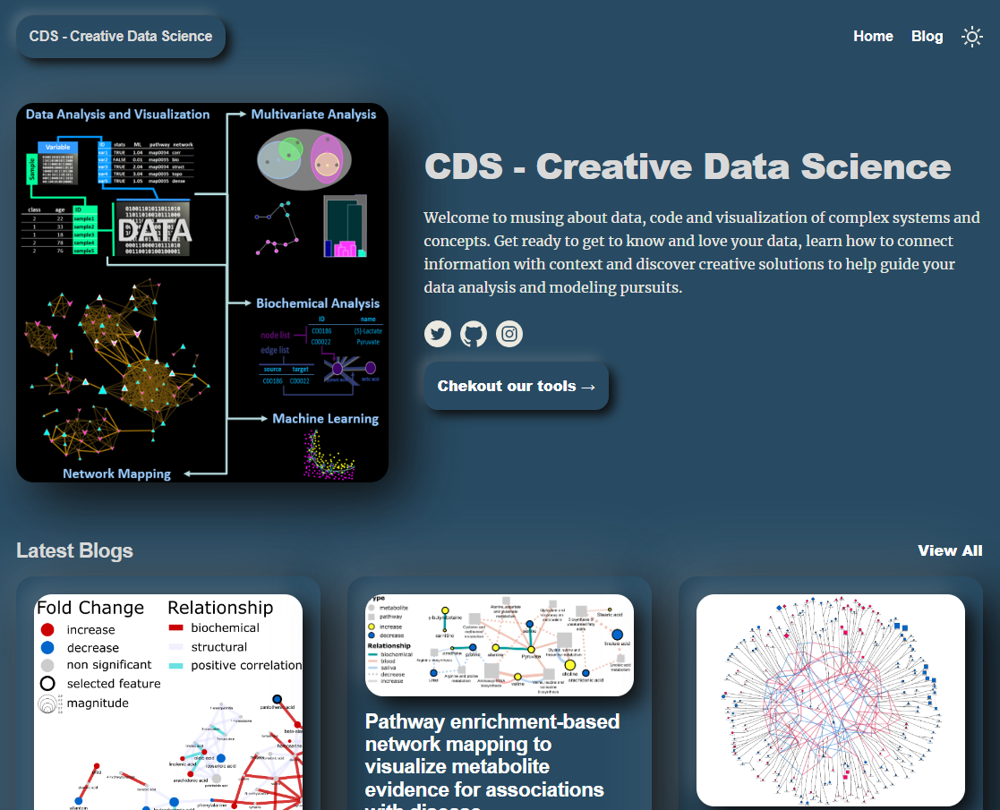

# Teaching Demos
***

Bioinformatics related demos and tutorials using the R programming language.

*** 

# Courses 

***

### [see all courses](https://creativedatasolutions.github.io/CDS.courses/)

* ### [R programming for Data Science - a beginner's guide](https://creativedatasolutions.github.io/R_programming_for_DS_beginner/)
* ### [Network mapping 101](https://creativedatasolutions.github.io/CDS.courses/courses/network_mapping_101/docs/)

***

# Blog

* ###  [Creative Data Science Blog](https://creativedatasolutions.github.io/cds.blog/)
* ### [R programming, bioinformatics and data visualization](https://imdevsoftware.wordpress.com/)

***

## Software

* ### [CDS](https://creative-data.science/#)

***

# R Code Examples and More

***

## Data Analysis Examples
* ### [Metabolomic and Proteomic Data Analysis 2015](https://github.com/dgrapov/TeachingDemos/blob/master/Demos/Data%20Analysis%20Workflow/report/report.md)

***

## Data Wrangling
* ### [Data wrangling for Data Science](https://creativedatasolutions.github.io/R_programming_for_DS_beginner/data_wrangling.html)
* ### [dplyr tutorial: verbs and split-apply](https://github.com/dgrapov/TeachingDemos/blob/master/Demos/dplyr/hands_on_with_dplyr.md)

***

## Statistical Analysis
* ### [Covariate Adjustment](https://github.com/dgrapov/TeachingDemos/blob/master/Demos/Statistical%20Analysis/Covariate%20Adjustment.md)

***

## Principal Components Analysis (PCA)
* ### [PCA for data exploration](https://creativedatasolutions.github.io/R_programming_for_DS_beginner/eda.html#multivariate-analysis)
* ### [PCA and scores visualization on custom data](https://gist.github.com/dgrapov/2fd3027d2bd7f15884b2d40a82d50c06) (fast and simple)
* ### [PCA on mtcars](https://github.com/dgrapov/TeachingDemos/wiki/Principal-Components-Analysis) (fast and simple)

***

## PLS
* ### [Partial Least Squares (PLS)](https://github.com/dgrapov/TeachingDemos/wiki/Partial-Least-Squares) (fast and simple)

***

## Predictive Modeling
* ### [O-PLS Example](https://github.com/dgrapov/TeachingDemos/blob/master/Demos/Predictive%20Modeling/O-PLS/OPLS_example.md) (04/08/15)
* ### [O-PLS-DA compared to Random Forest](https://github.com/dgrapov/TeachingDemos/blob/master/Demos/Predictive%20Modeling/Iris%20O-PLS-DA/O-PLS_modeling_of_Iris_data.md) (updated 11/7/15)
* ### [Comparing single to multiple Y models](https://github.com/dgrapov/TeachingDemos/blob/master/Demos/OPLS/OPLS%20example.md)

***

## Database query and translation
* ### [Translating Between Chemical Identifiers](https://github.com/dgrapov/TeachingDemos/wiki/Translating-Between-Chemical-Identifiers)  (intermediate)
* ### [CTSgetR](https://github.com/dgrapov/CTSgetR)

***

## Network Visualizations
* ### [Network mapping 101](https://creativedatasolutions.github.io/CDS.courses/courses/network_mapping_101/docs/)
* ### [Building Biochemical and Chemical Similarity Networks](https://github.com/dgrapov/TeachingDemos/wiki/Biochemical-and-Chemical-Similarity-Networks) (advanced)
* ### [KEGG Pathway Visualization](https://github.com/dgrapov/TeachingDemos/blob/master/Demos/Pathway%20Analysis/KEGG%20Pathway%20Enrichment.md) (genes, proteins and metabolites)

***

## Miscellaneous
* ### [Summer 2014 Metabolomic Data Analysis Workshop](http://imdevsoftware.wordpress.com/2013/09/08/sessions-in-metabolomics-2013/)
* ### [Winter 2014 Metabolomic Data Analysis Workshop](http://imdevsoftware.wordpress.com/2014/02/17/tutorials-statistical-and-multivariate-analysis-for-metabolomics/)

***
